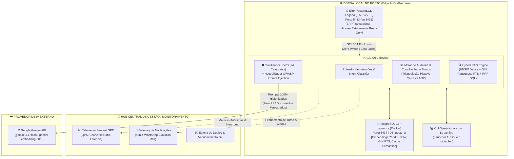
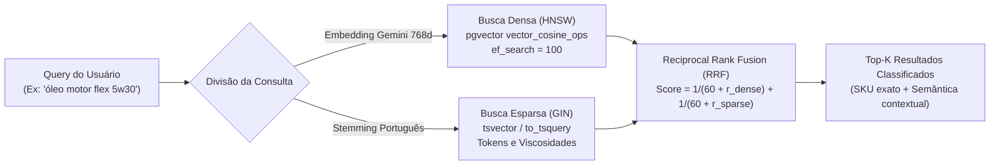
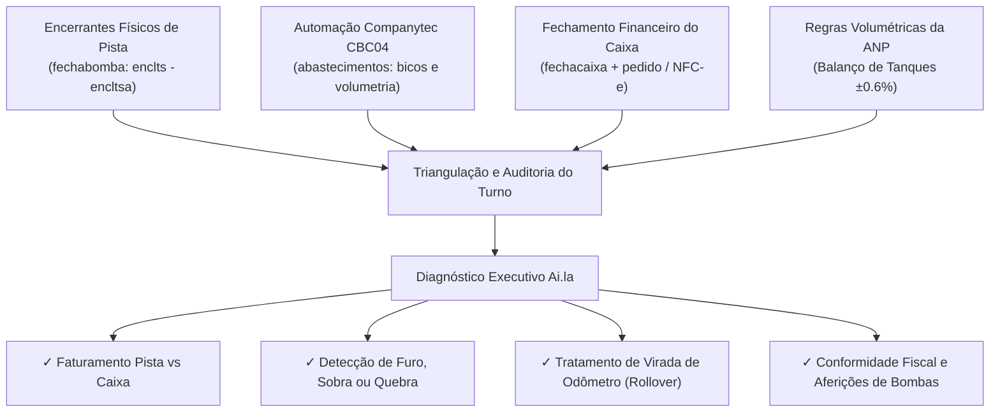
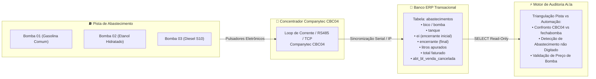

# ⛽ Ai.la — Inteligência Artificial Local Especialista em Postos de Combustíveis & PDV

<div align="center">

[](https://www.python.org/)
[](https://www.postgresql.org/)
[](https://github.com/pgvector/pgvector)
[](https://ai.google.dev/)
[](https://www.docker.com/)
[](#blindagem-lgpd)
[](#conciliacao-turnos)
[](#automação-companytec-cbc04)

**Edge AI On-Premises para Operação de Pista, Gestão de Turnos, Catálogo Inteligente e Observabilidade de Postos e Redes de Varejo.**

[Topologia Arquitetural](#topologia-e-arquitetura-do-sistema) •
[Pilares e Princípios](#princípios-arquiteturais) •
[Recursos e Módulos](#módulos-e-capacidades-do-sistema) •
[Automação CBC04](#automação-companytec-cbc04) •
[Início Rápido](#guia-de-inicialização-rápida) •
[Estrutura de Pastas](#estrutura-do-projeto) •
[Validação e Testes](#validação-e-testes-automatizados)

</div>

---

## 📌 Visão Geral do Produto

O **Ai.la** é uma solução de **Edge AI de altíssima performance** desenvolvida especificamente para a realidade operacional de postos de combustíveis e lojas de conveniência no Brasil. 

Construído sobre o princípio inegociável de que **o posto não pode parar e nenhum dado de cliente ou faturamento pode vazar**, o sistema executa inferência híbrida na borda local, integrando o banco transacional legado do posto (**ERP em PostgreSQL 9.5 a 16**) a um mecanismo de banco vetorial (**PostgreSQL 16 com `pgvector`**) e aos modelos de última geração **Google Gemini (3.1 Flash / 768d Embeddings)**.

Com processamento local e sanitização de dados em tempo de execução, o Ai.la entrega:
1. **Auditoria de Pista e Fechamento de Turno em Segundos** com conciliação automática de encerrantes físicos, automação de bombas **Companytec CBC04**, aferições, quebras/sobras de caixa e regras de conformidade da **ANP (Agência Nacional do Petróleo)**.
2. **Busca Semântica & Lexical Híbrida (HNSW + GIN FTS + RRF)** no catálogo de conveniência e lubrificantes, resolvendo linguagem natural coloquial do frentista/gerente com tolerância a erros e resposta em menos de 80ms.
3. **Blindagem LGPD & OWASP GenAI 2026** com expurgo estrito de 24 categorias de PII (CPFs validados, placas Mercosul, cartões TEF, telefones, chaves SEFAZ) antes de qualquer interação externa.
4. **Custo de Nuvem Quase Zero** através de cache semântico com vetor de meia precisão (`halfvec`) e execução 100% on-premises no hardware existente do posto.

---

<a id="topologia-e-arquitetura-do-sistema"></a>
## 🏛️ Topologia e Arquitetura do Sistema

O ecossistema adota uma **Topologia Híbrida de Borda (Edge AI On-Premises + Hub Central de Gestão)**:



---

<a id="princípios-arquiteturais"></a>
## 💎 Princípios Arquiteturais

### 1. Estratégia Zero-Disruption no ERP Legado
* **O Desafio:** Postos operam com ERPs legados consolidados (rodando em PostgreSQL 9.5, 10 ou 12 no Windows). Atualizar a versão do banco do ERP é inviável e causaria paradas críticas nas bombas e na emissão de NFC-e/SAT.
* **A Solução:** O ERP do posto permanece 100% intocado na porta padrão (`5433` ou `5432`). O Ai.la provisiona uma instância dedicada e isolada de **PostgreSQL 16 com `pgvector` em Docker na porta `5434`**.
* **Isolamento de Conexão Estritamente Read-Only:** A inteligência artificial conecta-se ao ERP exclusivamente com privilégios de `SELECT`. O sistema **jamais executa `INSERT`, `UPDATE`, `DELETE` ou `ALTER TABLE`**, e nunca adquire travas de escrita (*table locks*) nas tabelas vitais (`abastecimentos`, `fechabomba`, `fechacaixa`, `produtos`, `pedido`).

### 2. Edge AI com Privacidade e Custo Mínimo
* Todas as buscas no catálogo, conciliações matemáticas de turno, cruzamentos contábeis e vetorizações ocorrem no processador e na memória do hardware local.
* Redução drástica de chamadas à nuvem via **Cache Semântico Vetorial em PostgreSQL (`halfvec`)**: perguntas frequentes retornam respostas em ~300ms a custo zero de tokens.

### 3. Isolamento Contextual Multi-Posto (Tenant Isolation)
* Cada filial ou posto parceiro opera sua base vetorial isolada (`posto_ai` ou `posto_{tenant_id}`).
* Preços de combustíveis, políticas comerciais, cadastros de frentistas e margens de lucro nunca são compartilhados ou mesclados entre postos.

---

<a id="módulos-e-capacidades-do-sistema"></a>
## 🚀 Módulos e Capacidades do Sistema

<a id="busca-hibrida"></a>
### 🔍 1. Mecanismo de Busca Híbrida: Dual Retrieval + Native RRF

O motor [`HybridRAGEngine`](file:///C:/Users/Marlon/Documents/Agent%20PC/ia-banco-local/core/rag_engine.py) combina busca vetorial densa com busca textual esparsa utilizando uma única transação SQL no PostgreSQL 16 com **Reciprocal Rank Fusion (RRF)**:



#### Características de Indexação do pgvector:
* **Índice HNSW Densa:** `idx_produtos_vetores_hnsw` com `m = 16`, `ef_construction = 64` e `ef_search = 100` em tempo de execução.
* **Índice GIN Esparsa:** `idx_produtos_vetores_tsv_gin` com dicionário `portuguese` para correspondência exata de viscosidades (`5W30`, `15W40`), marcas (`Havoline`, `Lubrax`, `Mobil`) e códigos de barras.
* **Score RRF Ponderado:**

$$
RRF(d) = \sum_{m \in M} \frac{1}{k + r_m(d)} \quad \text{com } k = 60
$$

---

<a id="conciliacao-turnos"></a>
### 📊 2. Motor de Conciliação de Turnos & Auditoria de Pista

O módulo [`PostoTools.auditar_fechamento_turno`](file:///C:/Users/Marlon/Documents/Agent%20PC/ia-banco-local/core/tools.py) realiza a triangulação contábil e operacional completa entre os diferentes registros do posto:



#### Regras de Negócio e Cálculos Auditados:
* **Fórmula Física do Encerrante:**

$$
\text{Volume Bruto} = \text{Encerrante Final} - \text{Encerrante Inicial}
$$

$$
\text{Volume Faturado} = \max(0, \text{Volume Bruto} - \text{Litros de Aferição})
$$

* **Tratamento de Virada de Odômetro (Rollover):**
  Identifica automaticamente quando o totalizador físico do bico atinge o limite do relógio (99.999, 999.999 ou 9.999.999 litros) e recomeça do zero, sem acusar furos falsos:

$$
\text{Volume Rollover} = (\text{Limite} - \text{Encerrante Inicial}) + \text{Encerrante Final} - \text{Aferição}
$$

* **Tolerância Volumétrica ANP:**
  Monitora a variação física entre o estoque contábil e a medição dos tanques dentro da faixa de conformidade oficial de **±0.6%**.
* **Status Auditados do Turno:** `CONCILIADO_COM_SUCESSO`, `DIVERGENCIA_DETECTADA`, `DIVERGENCIA_CRITICA`, `TURNO_EM_ANDAMENTO`, `SEM_MOVIMENTO`.

---

<a id="blindagem-lgpd"></a>
### 🛡️ 3. Blindagem LGPD & Segurança OWASP GenAI

O módulo [`CentralLogSanitizer`](file:///C:/Users/Marlon/Documents/Agent%20PC/ia-banco-local/core/sanitizer.py) executa higienização determinística com **24 categorias de proteção de dados sensíveis e segurança**:

| Categoria | Regra de Detecção / Validação | Padrão / Marcador |
| :--- | :--- | :--- |
| **CPF** | Regex contextual + validação matemática de dígitos verificadores da Receita Federal | `[REDACTED:CPF]` ou `123.***.***-45` |
| **CNPJ** | Padrão numérico clássico e novo padrão alfanumérico 2026 | `[REDACTED:CNPJ]` |
| **Placas de Veículos** | Padrão clássico brasileiro (`ABC-1234`) e Padrão Mercosul (`ABC1D23`) | `[REDACTED:PLACA]` |
| **Cartões de Crédito / TEF** | Formatos TEF e bandeiras de 13 a 16 dígitos com separadores | `[REDACTED:CREDIT_CARD]` |
| **Chaves de Acesso SEFAZ** | 44 dígitos com validação algorítmica de DV SEFAZ módulo 11 (NF-e/NFC-e) | `[REDACTED:FISCAL_ACCESS_KEY]` |
| **Telefones e Fidelidade** | Telefones fixos, móveis, WhatsApp, KMV, Premmia, ShellBox | `[REDACTED:PHONE]` |
| **Senhas e Credenciais** | Connection strings, strings SQL, JSONs, cabeçalhos e variáveis | `[REDACTED:PASSWORD]` |
| **Tokens e Chaves de API** | Bearer, JWTs, Google AIza, AWS AKIA, OpenAI sk- | `[REDACTED:TOKEN]` |
| **Certificados Digitais** | Blocos PEM de certificados A1/A3 e chaves privadas | `[REDACTED:CERTIFICATE]` |
| **OWASP Prompt Injection** | Detecção de jailbreaks, tentativas de override e injeções de SQL | `[NEUTRALIZED_PROMPT_INJECTION_OWASP_ACS]` |
| **Vocabulário de Posto (NLP)** | Reconhecimento de entidades via spaCy: `abastecimentos`, `fechabomba`, `CBC04` | *Entidades preservadas com valor contábil intacto* |

---

<a id="automação-companytec-cbc04"></a>
### 🎛️ 4. Integração com Concentrador Companytec CBC04

O Ai.la audita diretamente os dados emitidos pelo concentrador de pista **Companytec CBC04** (e compatíveis CBC02 / CBC06), que interliga eletronicamente as bombas de combustível ao ERP:



#### Capacidades da Auditoria da Automação CBC04:
1. **Leitura Ponto-a-Ponto dos Pulsadores:** Coleta de `ei` (encerrante inicial do bico) e `encerrante` (encerrante final) registrados diretamente pelo hardware a cada desarme do bico, com precisão de milésimos de litro.
2. **Identificação de Abastecimentos Fantasmas:** Alerta imediato caso a automação CBC04 tenha registrado fluxo volumétrico mas o operador não tenha lançado os encerrantes no fechamento (`PENDENTE_ENCERRANTE`).
3. **Filtro de Desvios e Cancelamentos:** Expurgo automático de abastecimentos cancelados em pista (`abt_bl_venda_cancelada IS NOT TRUE`), evitando distorções contábeis.
4. **Detecção de Divergências de Preço de Bomba:** Compara o valor faturado por litro na pista com o preço vigente no cadastro de produtos do ERP, identificando frentistas vendendo com preço desatualizado ou divergente.

---

<a id="guia-de-inicialização-rápida"></a>
## ⚡ Guia de Inicialização Rápida

### Pré-requisitos
* **Sistema Operacional:** Windows 10/11 ou Windows Server (ambiente nativo dos PDVs).
* **Python:** 3.11 ou 3.12 instalado.
* **Docker Desktop:** Instalado e em execução (para o container do `pgvector`).
* **PostgreSQL do ERP:** PostgreSQL 9.5+ rodando na porta `5433` (ou configurável no `.env`).

### 1. Clonar o Repositório
```powershell
git clone https://github.com/marlonhms/IA-Local.git
cd IA-Local
```

### 2. Configurar o Ambiente Virtual e Dependências
```powershell
python -m venv .venv
.venv\Scripts\activate
pip install -r requirements.txt
```

### 3. Configurar as Variáveis de Ambiente
Copie o arquivo de exemplo e preencha suas credenciais:
```powershell
copy .env.example .env
```

Edite o `.env` com suas configurações:
```ini
# Google Gemini API
GEMINI_API_KEY=sua_chave_gemini_aqui

# Banco ERP Transacional (PostgreSQL Windows)
ERP_DB_HOST=localhost
ERP_DB_PORT=5433
ERP_DB_NAME=posto
ERP_DB_USER=suporte
ERP_DB_PASSWORD=sua_senha_erp

# Banco Vetorial Semântico (PostgreSQL 16 Docker pgvector)
VECTOR_DB_HOST=localhost
VECTOR_DB_PORT=5434
VECTOR_DB_NAME=posto_ai
VECTOR_DB_USER=postgres
VECTOR_DB_PASSWORD=sua_senha_pgvector

# Modelos Google Gemini
DEFAULT_EMBEDDING_MODEL=models/gemini-embedding-001
DEFAULT_LLM_MODEL=models/gemini-3.1-flash-lite
```

### 4. Subir o Container Docker do pgvector
Caso ainda não tenha o container criado:
```powershell
docker run -d --name pgvector-posto -p 5434:5432 -e POSTGRES_DB=posto_ai -e POSTGRES_PASSWORD=sua_senha_pgvector pgvector/pgvector:pg16
```

### 5. Iniciar a Aplicação

#### Opção A: Launcher 1-Clique (Recomendado no Posto)
Dê um duplo clique no arquivo [`iniciar.bat`](file:///C:/Users/Marlon/Documents/Agent%20PC/ia-banco-local/iniciar.bat) ou execute no PowerShell:
```powershell
.\iniciar.bat
```
*O script verifica se o Docker e o serviço do PostgreSQL estão ativos, inicializa os serviços necessários e abre o terminal interativo da IA.*

#### Opção B: Via Linha de Comando Direta
```powershell
python main.py
```

---

<a id="estrutura-do-projeto"></a>
## 📁 Estrutura do Projeto

```text
ia-banco-local/
├── .env.example              # Modelo documentado de variáveis de ambiente
├── .gitignore                # Proteção rigorosa contra vazamento de credenciais e dumps
├── requirements.txt          # Dependências do projeto (psycopg2, google-generativeai, spacy, etc.)
├── README.md                 # Documentação técnica e guia do sistema
├── iniciar.bat               # Launcher operacional Windows 1-clique (Docker + Postgres + CLI)
├── iniciar.ps1               # Launcher PowerShell alternativo
├── main.py                   # CLI interativo principal com streaming token-a-token
│
├── config/                   # Módulo de configurações centralizadas
│   ├── __init__.py
│   └── settings.py           # Gestão de credenciais, portas e parâmetros de IA
│
├── core/                     # Núcleo analítico e motor agêntico
│   ├── __init__.py
│   ├── rag_engine.py         # Motor HybridRAGEngine (HNSW + FTS GIN + RRF nativo SQL)
│   ├── sanitizer.py          # CentralLogSanitizer (LGPD 24 categorias + OWASP GenAI)
│   └── tools.py              # PostoTools (Auditoria de Turnos, Automação CBC04, PDV, Tanques)
│
├── scripts/                  # Scripts de automação, manutenção e testes
│   ├── __init__.py
│   ├── index_produtos.py     # Pipeline ETL de indexação e enriquecimento vetorial
│   ├── sync_daemon.py        # Daemon de sincronização contínua ERP -> pgvector
│   ├── benchmark_rag.py      # Benchmark comparativo de precisão, recall e latência
│   ├── test_sanitizer.py     # Suíte de testes da blindagem LGPD e sanitização
│   └── test_conciliacao_turno.py # Suíte de testes do motor de conciliação de turnos
│
├── docs/                     # Documentação de arquitetura e roadmap
│   ├── dossie_tecnico.md     # Dossiê técnico completo de infraestrutura e SRE
│   └── roadmap_aila.md       # Roadmap estratégico e planejamento das fases de evolução
│
└── backups/                  # Diretório protegido para rotinas de backup locais
    └── .gitkeep              # Estrutura mantida no Git (dumps .backup são ignorados)
```

---

<a id="validação-e-testes-automatizados"></a>
## 🧪 Validação e Testes Automatizados

O sistema conta com suítes de testes unitários e de integração de ponta a ponta:

### 1. Testes de Blindagem LGPD e Sanitização
Valida validação de CPFs da Receita Federal, regex de placas Mercosul, ofuscação de cartões TEF, extração de entidades NLP via spaCy e neutralização de injeções OWASP:
```powershell
python scripts/test_sanitizer.py
```
*Resultado: **100% dos testes aprovados**.*

### 2. Testes do Motor de Conciliação de Turnos
Valida o classificador semântico de intenções, normalizadores de data/turno, regras de virada de odômetro, telemetria da Companytec CBC04, tolerância ANP (±0.6%) e triangulação contábil com o ERP:
```powershell
python scripts/test_conciliacao_turno.py
```
*Resultado: **100% dos testes aprovados**.*

### 3. Benchmark de Recuperação Vetorial
Executa comparativo de latência e qualidade entre Busca Densa Pura (HNSW), Busca Esparsa Pura (GIN) e a Fusão Híbrida (RRF):
```powershell
python scripts/benchmark_rag.py
```

---

<a id="segurança-e-conformidade"></a>
## 🔒 Segurança e Conformidade

1. **Blindagem de Segredos:** O `.gitignore` é configurado para impedir sumariamente o commit de arquivos `.env`, chaves de API, senhas do ERP (`erp_password.txt`) e arquivos de dump (`*.backup`).
2. **Conexões com o ERP:** Operações de consulta utilizam parametrização SQL estrita com `psycopg2`, prevenindo qualquer forma de SQL Injection.
3. **Respeito aos Direitos dos Titulares (LGPD):** Dados pessoais nunca saem da infraestrutura do posto sem ofuscação prévia.

---

## 📄 Licença e Direitos

Projeto desenvolvido para operações inteligentes em postos de combustíveis e varejo de conveniência.  
Distribuído sob licença proprietária. Todos os direitos reservados.
