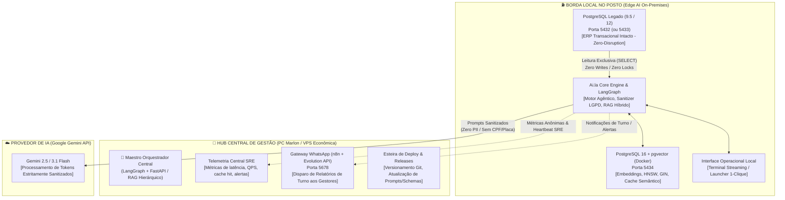
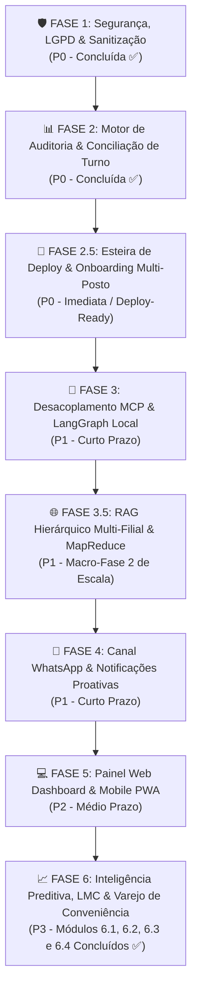

# 🚀 Roadmap Estratégico & Engenharia de Execução: Projeto Ai.la

**Projeto:** Ai.la — IA Local Especialista em Postos de Combustíveis e PDV  
**Versão:** 1.6.0-PRO  
**Status Atual:** MVP Local de Nó Único Consolidado (Fases 1, 2, 6.1, 6.2, 6.3 e 6.4: LMC Oficial ANP e Loja de Conveniência / Market Basket Analysis & Vendas Cruzadas Homologadas + Sugestão 1: Roteador Semântico Vetorial pgvector e Sugestão 2: Otimização RAG CDC Delta Hash & RRF Calibrado Concluídas com 100% de Aprovação)  
**Próximas Frentes:** Fase 2.5 (Esteira de Deploy Automatizado & Onboarding Multi-Posto) $\rightarrow$ Fase 3 (MCP + LangGraph) $\rightarrow$ Fase 3.5 (RAG Hierárquico Multi-Filial & MapReduce)  
**Ambiente:** Edge AI Local (Postos) + Maestro Central de Gestão/Telemetria | Docker + PostgreSQL 16 (Portas 5432/5433, 5434, 5678)  

---

## 🧭 1. Visão Geral e Topologia Arquitetural Híbrida

O **Ai.la** foi concebido a partir de um princípio inegociável de engenharia de software e segurança: **o posto de combustível não pode parar e os dados dos clientes não podem vazar.**

Para viabilizar a escala do produto para dezenas ou centenas de postos com **custo zero de infraestrutura em nuvem** e **100% de blindagem LGPD**, o sistema adota uma **Topologia Híbrida Edge AI (Borda Local no Posto + Hub Central de Gestão)**.



### 🏛️ Pilares Arquiteturais Fundamentais

1. **Estratégia de Coexistência PostgreSQL (Zero-Disruption):**
   - **O Cenário Real:** A esmagadora maioria dos postos de combustíveis opera com ERPs legados consolidados há anos, rodando sobre PostgreSQL 9.5, 10 ou 12 no Windows. Essas versões são completamente incompatíveis com a extensão vetorial moderna `pgvector` (que requer PG 15+). Fazer upgrade de versão no banco do ERP é inviável comercialmente, pois quebraria o ERP legado e arriscaria travar as bombas de combustível e emissão de NFC-e.
   - **A Solução Zero-Disruption:** O ERP do cliente permanece intacto e soberano na porta padrão (`5432` ou `5433`). O Ai.la provisiona uma instância dedicada e isolada de **PostgreSQL 16 com pgvector via container Docker na porta `5434`**.
   - **Acesso Estritamente Read-Only:** A conexão do Ai.la com o banco do ERP é configurada exclusivamente com permissões de `SELECT`. O agente **nunca executa `INSERT`, `UPDATE`, `DELETE`, `ALTER TABLE` nem adquire travas de escrita** nas tabelas do ERP (`abastecimentos`, `fechabomba`, `fechacaixa`, `produtos`, `pedido`, etc.). O risco de corrupção ou indisponibilidade no ERP é estritamente zero.

2. **Topologia Híbrida Edge AI (100% LGPD Compliant & Custo Zero):**
   - **Processamento 100% Local no Posto:** RAG híbrido, vetorização, enriquecimento léxico e consultas de banco rodam diretamente no hardware já existente no posto.
   - **Latência Ultra-Baixa (<80ms):** Consultas ao catálogo e conciliações de turno ocorrem localmente sem round-trip desnecessário para data centers na nuvem.
   - **Blindagem LGPD Absoluta:** Dados de vendas, faturamento, identificação de frentistas e documentos de clientes jamais trafegam abertos pela internet. Antes de qualquer envio de prompt para a API do Google Gemini, a camada local `CentralLogSanitizer` ofusca deterministicamente 24 categorias de PII (CPFs validados, placas Mercosul, cartões TEF, telefones).
   - **Hub Central Leve:** O ambiente de gestão central (PC Marlon ou VPS econômica de baixo custo) atua como concentrador de telemetria SRE anônima (saúde e performance), versionador de código, orquestrador Maestro de consultas de rede e gateway de WhatsApp via n8n.

3. **Isolamento Contextual por Posto (Tenant-Isolated RAG):**
   - Cada posto de combustível possui seu próprio banco vetorial isolado (`posto_ai` ou `posto_{tenant_id}`).
   - Não há compartilhamento de base vetorial entre postos distintos. Isso impede de forma categórica a contaminação de preços de combustíveis, políticas de desconto, cadastros de colaboradores ou catálogo de conveniência entre clientes concorrentes.

4. **Orquestração com LangGraph Local na Borda (`core/`):**
   - Para queries simples de busca e catálogo, o Ai.la utiliza o motor `HybridRAGEngine` em rota direta de alta velocidade.
   - Para operações complexas de auditoria, conciliação e diagnóstico de pista, a orquestração multi-agente é gerenciada localmente via **LangGraph** estruturado na pasta `core/`:
     - **Nó 1 (Parser & Sanitizer):** Normalização de data/turno e expurgo de injeções OWASP / dados PII.
     - **Nó 2 (SQL Data Gathering):** Coleta paralela de `fechabomba`, `fechacaixa` e telemetria da Companytec CBC04.
     - **Nó 3 (Auditor Matemático & ANP):** Aplicação de fórmulas de encerrante, rollover de hodômetro e regra volumétrica de $\pm 0.6\%$.
     - **Nó 4 (Diagnóstico SRE & Parecer Executivo):** Formatação com streaming token-a-token para o gestor.
5. **Topologia de Rede Distribuída: RAG Hierárquico Multi-Filial (MapReduce Fan-Out / Fan-In):**
   - Para donos e gestores de redes de postos, o Ai.la transcende o nó único local e opera como um ecossistema distribuído de alta eficiência de tokens e blindagem LGPD.
   - **O Maestro Central (LangGraph + FastAPI)** atua no Hub ou nuvem privada: recebe consultas executivas globais (*"Qual o status de estoque de gasolina comum de toda a rede?"*), divide a demanda e efetua um **Fan-Out assíncrono** com `asyncio` e HTTP/REST para os Edge Workers em contêineres Docker de todas as filiais simultaneamente.
   - **Os Edge Workers Locais** processam a consulta na borda: executam SQL read-only seguro no banco ERP local e no `pgvector` local, higienizam os dados com spaCy e retornam apenas um payload **JSON estruturado validado via Pydantic v2**, sem gerar texto livre prolixo.
   - **Resiliência e Tolerância a Falhas com SLA de 5s:** O Maestro opera com timeout estrito de 5 segundos e mecanismo de **Degradação Graciosa (Graceful Degradation)**: se um posto estiver sem internet, o sistema não sofre crash; consolida os postos online e adiciona uma flag informativa para a unidade inacessível.
   - **Fan-In e Síntese Executiva via LLM:** O Maestro agrega os JSONs recebidos e submete a um **Agente LLM Sintetizador** especializado, que ranqueia as filiais da mais crítica para a mais confortável e gera o parecer executivo consolidado com consumo mínimo de tokens.

```mermaid
flowchart TB
    USER["👤 Dono da Rede / Gestor Geral\nConsulta: 'Qual o status de estoque de gasolina de toda a rede?'"]

    subgraph HUB["🏢 NÓ CENTRAL / MAESTRO ORQUESTRADOR (LangGraph + FastAPI)"]
        MAESTRO["🎼 Maestro Orquestrador Central"]
        ROUTER{"Roteador de Escopo\n(Global vs Filial Específica?)"}
        DISPATCH["⚡ Fan-Out Assíncrono (asyncio)\nTimeout SLA: 5.0s | Concorrência Não-Bloqueante"]
        UNICAST["🎯 Despacho Unicast Direto\n(Bypassa Fan-Out da Rede)"]
        COLLECTOR["📥 Coletor de Payloads (Fan-In)\n+ Tratador de Nós Offline (Graceful Degradation)"]
        FALLBACK_HUB["🛡️ Fallback de Resiliência (Gerado no Hub)\n{'aviso': 'Filial Posto Sul offline, dados não incluídos.'}"]
        SYNTH["🤖 Agente Sintetizador Executivo (LLM)\n[Ranqueamento Crítico → Confortável | Economia >85% Tokens]"]
    end

    subgraph NETWORK["🌐 REDE DISTRIBUÍDA DE FILIAIS (Edge Computing On-Premises)"]
        subgraph POSTO1["⛽ Filial 01 - Posto Centro"]
            EDGE1["Worker Docker Local (FastAPI)\n• SQL Seguro (SELECT-only)\n• pgvector + ERP Local\n• Sanitização spaCy (LGPD)"]
            JSON1["Payload JSON Pydantic v2\n{'filial': 'Centro', 'combustivel': 'Gasolina Comum', 'status': 'Critico', 'autonomia_horas': 14}"]
        end

        subgraph POSTO2["⛽ Filial 02 - Posto Norte"]
            EDGE2["Worker Docker Local (FastAPI)\n• SQL Seguro (SELECT-only)\n• pgvector + ERP Local\n• Sanitização spaCy (LGPD)"]
            JSON2["Payload JSON Pydantic v2\n{'filial': 'Norte', 'combustivel': 'Gasolina Comum', 'status': 'Regular', 'autonomia_horas': 96}"]
        end

        subgraph POSTO3["⛽ Filial 03 - Posto Sul (Link Down / Sem Internet)"]
            EDGE3["Worker Docker Local (Inacessível / Timeout SLA 5s)"]
        end
    end

    USER --> MAESTRO
    MAESTRO --> ROUTER
    ROUTER -->|Escopo Global (Toda a Rede)| DISPATCH
    ROUTER -->|Escopo Local (Filial Única)| UNICAST

    DISPATCH -->|Async HTTP GET/POST| EDGE1
    DISPATCH -->|Async HTTP GET/POST| EDGE2
    DISPATCH -.->|Timeout 5s / Conexão Recusada| EDGE3
    UNICAST -->|Async HTTP GET/POST| EDGE1

    EDGE1 --> JSON1
    EDGE2 --> JSON2

    JSON1 --> COLLECTOR
    JSON2 --> COLLECTOR
    DISPATCH -.->|Injeção no SLA Expirado| FALLBACK_HUB
    FALLBACK_HUB --> COLLECTOR

    COLLECTOR --> SYNTH
    SYNTH -->|Relatório Gerencial Consolidado| USER
```

---

## 📊 2. Matriz de Priorização (Esforço x Impacto)

```
        ▲ ALTO
        │  [Fase 1: Sanitizador LGPD]       [Fase 2: Conciliação de Turnos]
        │  [Fase 2.5: Deploy Multi-Posto]   [Fase 3: Servidor MCP / LangGraph]
        │  [Fase 4: Alertas WhatsApp]       [Fase 3.5: RAG Multi-Filial MapReduce]
IMPACTO │                                   [Fase 6: IA Preditiva & LMC]
        │  [Fase 5: Dashboard Web PWA]      
        │
        └─────────────────────────────────────────────────────────────►
          BAIXO                     ESFORÇO                      ALTO
```

---

## 🗺️ 3. Fases do Roadmap em Ordem de Prioridade



---

## 🛠️ 4. Detalhamento Técnico das Fases

### 🛡️ FASE 1: Blindagem de Dados, LGPD & Camada de Sanitização (Status: Concluída ✅)
> **Objetivo:** Garantir que o envio de prompts para modelos externos (Google Gemini) nunca contenha dados que identifiquem clientes ou veículos, cumprindo integralmente a LGPD e evitando riscos jurídicos.

- [x] **Módulo `CentralLogSanitizer` (Pré-Prompt & In-Tool):**
  - Interceptor regex e heurístico de 24 categorias implementado em `core/sanitizer.py`.
  - Ofuscação dinâmica ativa:
    - **Placas de Veículos:** Padrão Mercosul e antigas $\rightarrow$ `[REDACTED:PLACA]`.
    - **CPFs e CNPJs:** Validação algorítmica de DV oficial da Receita Federal $\rightarrow$ `[REDACTED:CPF]` e `[REDACTED:CNPJ]`.
    - **Telefones de Fidelidade:** KMV, ShellBox, Premmia $\rightarrow$ `[REDACTED:PHONE]`.
    - **Cartões e TEF:** 13 a 16 dígitos com formato de trilha TEF $\rightarrow$ `[REDACTED:CREDIT_CARD]`.
    - **OWASP GenAI 2026:** Injeções de prompt indiretas neutralizadas com `[NEUTRALIZED_PROMPT_INJECTION_OWASP_ACS]`.
- [x] **Entregáveis da Fase 1:**
  - `core/sanitizer.py` (motor de sanitização unificado com spaCy NLP e regex).
  - `scripts/test_sanitizer.py` (suíte de testes automatizada com 100% de aprovação).
  - Integração nativa em `main.py` (telemetria e pré-prompt) e `core/tools.py` (`sanitize_dict`).

---

### 📊 FASE 2: Motor de Conciliação de Turnos & Auditoria de Pista (Status: Concluída ✅)
> **Objetivo:** Cruzar o faturamento de caixa com os encerrantes das bombas e os níveis dos tanques, respondendo a pergunta de ouro do dono do posto: *"O caixa bateu com o que saiu dos bicos?"*

- [x] **Mapeamento e Triangulação SQL:**
  - Query analítica de alta performance cruzando em tempo real:
    1. **Automação Companytec CBC04 (`abastecimentos`):** Volume real faturado, encerrantes inicial (`ei`) e final (`encerrante`) da automação.
    2. **Fechamento de Pista (`fechabomba`):** Cálculo de volume bruto e faturado com suporte a virada de hodômetro mecânico/digital (rollover em 100k, 1M, 10M), detecção de erros de leitura e desconto de aferições do Inmetro (`qtdeaf`).
    3. **Fechamento de Caixa (`fechacaixa` & `funcionarios`):** Valores declarados em dinheiro (`valdinh`), cartão (`valcart`), a prazo (`valnotpra`), convênio/cheque (`valcheconv`, `valchevis`, `valchepre`), vinculados ao operador e caixa.
    4. **Pedidos PDV (`pedido`):** Cupons fiscais emitidos para fechamentos em andamento ou conferência em tempo real.
- [x] **Detecção de Quebras e Furos:**
  - Alerta de Divergência de Pista: Diferença entre encerrante mecânico/manual e telemetria da automação CBC04.
  - Alerta de Furo ou Sobra de Caixa: Comparação contábil rigorosa entre valores declarados e faturamento da pista (diferenciando turnos em andamento com caixas abertos de furos consolidados).
  - Balanço de Tanques e Regra ANP: Monitoramento volumétrico dos tanques contra tolerância legal de $\pm 0.6\%$ sobre a movimentação física quando há leitura de régua/sonda no turno.
- [x] **Nova Ferramenta do Agente (`auditar_fechamento_turno`):**
  - Implementada em `core/tools.py` com normalizadores robustos de turno (`1º TURNO`, `2º TURNO`, `3º TURNO`, `manhã`, `tarde`, `noite`, `madrugada`) e data (ISO, BR, DD/MM, extenso, "hoje", "ontem", "anteontem") com proteção contra SQL syntax error.
  - Roteamento e intenção `auditoria_turno` integrados em `main.py` com streaming token-a-token e parecer executivo.
- [x] **Entregáveis da Fase 2:**
  - `core/tools.py` atualizado com método `auditar_fechamento_turno()`, método `calcular_volume_encerrante()` com suporte a rollover, e proteção `sanitize_dict`.
  - `main.py` atualizado com classificador abrangente de intenções operacionais, extrator resiliente de linguagem natural e diretrizes no prompt de sistema.
  - `scripts/test_conciliacao_turno.py` suíte completa de testes unitários e de integração com 100% de aprovação.

---

### 📦 FASE 2.5: Esteira de Deploy Automatizado & Onboarding Multi-Posto (Planejamento Futuro / Na Esteira)
> **Objetivo:** Documentação de diretriz arquitetural para quando a estrutura do projeto estiver consolidada. Padronizar a instalação do Ai.la para novos postos em procedimento de 1-clique, garantindo coexistência harmônica com qualquer versão de ERP legado (PostgreSQL 9.5 / 12) sem necessidade de suporte técnico avançado no local.

- [ ] **Pacote de Containerização Docker Compose (`docker-compose.yml` - A ser criado futuramente):**
  - Imagem oficial otimizada: `pgvector/pgvector:pg16`.
  - Mapeamento de portas seguro: Exposição do pgvector na porta `5434` do host (mapeada para `5432` interna do container), eliminando qualquer colisão com o PostgreSQL do ERP (que roda na porta `5432` ou `5433`).
  - Persistência em volume Docker nomeado (`aila_pgvector_posto_data`).
  - *Tuning* de performance para máquinas de borda de postos (4GB a 16GB RAM):
    ```yaml
    command: >
      postgres
        -c shared_buffers=256MB
        -c work_mem=16MB
        -c maintenance_work_mem=64MB
        -c max_connections=50
    ```
  - Healthcheck nativo via `pg_isready` para inicialização determinística.

- [ ] **Script de Implantação Automatizada em 1-Clique (`scripts/deploy_posto.ps1` - A ser implementado futuramente):**
  - Pipeline planejado em fases executivas:
    1. **Checagem de Pré-requisitos:** Validação de Docker Engine / Docker Desktop ativo e Python 3.10+.
    2. **Diagnóstico e Verificação de Portas:** Teste de conectividade TCP no ERP legado (`5432`/`5433`) e confirmação de liberação da porta `5434`.
    3. **Subida da Instância Isolada:** Execução automatizada de `docker compose up -d`.
    4. **Healthcheck e Sincronismo:** Loop de prontidão até confirmação de conexões ativas pelo PostgreSQL 16.
    5. **Inicialização de Extensões e Migração de Schema:** Ativação automática de `CREATE EXTENSION IF NOT EXISTS vector;` e criação determinística das tabelas `produtos_vetores` (com índices HNSW + GIN) e `perguntas_cache`.
    6. **Indexação Inicial e Healthcheck SRE:** Carga inicial de catálogo e validação de prontidão SRE.

- [ ] **Configuração e Isolamento Parametrizado por Tenant:**
  - Parametrização via `.env` para cada posto implantado:
    ```env
    TENANT_ID=posto_alphaville_01
    POSTO_NOME="Posto Alphaville Matriz"
    ERP_DB_HOST=localhost
    ERP_DB_PORT=5432
    ERP_DB_NAME=posto
    ERP_DB_USER=suporte
    ERP_DB_PASSWORD=xxxxxx
    VECTOR_DB_HOST=localhost
    VECTOR_DB_PORT=5434
    VECTOR_DB_NAME=posto_ai
    ```

- [ ] **Entregáveis Planejados para a Fase 2.5:**
  - `docker-compose.yml` (template oficial na raiz do projeto).
  - `scripts/deploy_posto.ps1` (orquestrador de implantação em PowerShell idempotente).
  - `sql/schema_pgvector.sql` (schema DDL com extensão pgvector, índices HNSW e GIN).
  - Documentação de onboarding rápido para equipes de campo.

---

### 🔌 FASE 3: Desacoplamento MCP, API FastAPI & Orquestração LangGraph Local (Prioridade P1 - Curto Prazo)
> **Objetivo:** Tirar a IA do terminal e transformá-la em um microsserviço assíncrono padrão da indústria com orquestração agêntica multi-passos, permitindo que Web, Mobile e WhatsApp acessem exatamente o mesmo cérebro.

- [ ] **Orquestrador Multi-Agente com LangGraph Local (`core/langgraph_agent.py`):**
  - Implementação de StateGraph local para controle de estado e raciocínio multi-etapas:
    - **Roteador Semântico:** Classifica se a requisição é busca direta, cálculo matemático, auditoria de turno ou diagnóstico de telemetria.
    - **Agente de Pista & Tanques:** Focado em telemetria volumétrica e normas ANP.
    - **Agente de Caixa & PDV:** Focado em vendas, sangrias e conciliação contábil.
    - **Sintetizador Executivo:** Consolida achados em linguagem natural simples, objetiva e acionável para o dono do posto.
- [ ] **Servidor MCP Local Ai.la (`server/mcp_server.py`):**
  - Implementar um servidor Model Context Protocol local em Python expondo via JSON-RPC:
    - Tool `consultar_catalogo_produtos`
    - Tool `consultar_vendas_pdv`
    - Tool `consultar_estoque_tanques`
    - Tool `auditar_fechamento_turno`
    - Tool `telemetria_sre_banco`
- [ ] **Backend Web API (FastAPI):**
  - Criar camada de rotas HTTP REST + Server-Sent Events (SSE):
    - `POST /api/chat`: Transmissão de tokens via streaming para interfaces web/mobile.
    - `GET /api/relatorios/turno`: Endpoint rápido de fechamento consolidado.
    - `GET /api/sre/health`: Healthcheck do PostgreSQL ERP, pgvector e n8n.
- [ ] **Entregáveis da Fase 3:**
  - `core/langgraph_agent.py` (Grafo de estados e orquestrador agêntico).
  - `server/api.py` (FastAPI assíncrono).
  - `server/mcp_server.py` (Servidor MCP local).

---

### 🌐 FASE 3.5: Escalabilidade de Rede Multi-Filial — RAG Hierárquico Distribuído & MapReduce (Macro-Fase 2 de Escala)
> **Nomenclatura Estratégica:** Denominada originalmente pelo solicitante como **"Fase 2 - Escalabilidade Multi-Filial (RAG Hierárquico e MapReduce)"**, esta macro-etapa foi posicionada na esteira técnica como **Fase 3.5**, logo após o onboarding e deploy automatizado em 1-clique (Fase 2.5) e alinhada ao desacoplamento MCP/FastAPI/LangGraph (Fase 3).  
> **Condição de Destravamento (Gate Inegociável):** Esta fase será destravada **SOMENTE APÓS a consolidação plena do MVP Local de nó único** com `pgvector`, Docker, guardrails de SQL e sanitização via spaCy operando com zero alucinação e cálculos preditivos 100% precisos (atualmente com Fases 1, 2, 6.1 e 6.2 homologadas com 100% de testes).  
> **Objetivo:** Evoluir a arquitetura de um agente local isolado para um ecossistema de **RAG Hierárquico Multi-Agente (MapReduce)**. O objetivo é permitir que donos e diretores de redes de postos façam consultas globais em linguagem natural (ex: *"Qual o status de estoque de gasolina comum de toda a rede?"* ou *"Quais postos tiveram furo de caixa no turno da noite ontem?"*) e recebam um relatório gerencial consolidado, processado de forma distribuída para economizar dezenas de milhares de tokens e garantir a segurança e isolamento LGPD.

- [ ] **1. O Maestro (Agente Orquestrador Central):**
  - **Roteamento de Intenção e Escopo:** O Maestro avalia deterministicamente se o prompt do usuário é destinado a uma filial específica (*"Como está o fechamento do Posto Centro?"*) ou à rede global (*"Qual o status de estoque de gasolina de toda a rede?"*).
  - **Fan-Out (Disparo Assíncrono Paralelo):** Utilizando Python `asyncio` (`asyncio.gather`) e requisições HTTP assíncronas via `httpx`/FastAPI (ou mensageria leve via Redis/MQTT), o Maestro dispara a requisição simultaneamente para os endpoints/IPs dos contêineres Docker de todas as filiais cadastradas na rede.
  - **Isolamento de Credenciais:** O nó central gerencia apenas o catálogo de endereçamento dos postos e tokens mTLS/Bearer de serviço, sem armazenar dados brutos de transações ou dados pessoais (PII).

- [ ] **2. Edge Computing (Agentes Trabalhadores Locais na Borda):**
  - **Processamento na Borda (Edge Nodes):** Cada contêiner Docker local recebe o gatilho assíncrono do Maestro, converte o comando em consulta SQL segura e estritamente read-only (`SELECT`-only, sem permissão de escrita e sem locks de tabela).
  - **Execução Local com pgvector + ERP:** Consulta a instância vetorial local (`pgvector` porta 5434) e o banco ERP local (porta 5432/5433), aplicando as regras de negócio locais (autonomia de tanques, conciliação de encerrantes, vazão de bicos).
  - **Sanitização Determinística spaCy:** Antes de formatar o retorno, o worker local submete quaisquer strings ao `CentralLogSanitizer` (LGPD ativa na borda).
  - **Retorno Enxuto (Pydantic JSON Schema):** Para economizar banda, latência e custos de LLM, o agente local **NÃO gera texto natural prolixo**. Ele retorna estritamente um payload JSON estruturado e tipado validado via Pydantic v2:
    ```json
    {
      "filial_id": "posto_centro_01",
      "filial_nome": "Posto Centro",
      "combustivel": "Gasolina Comum",
      "saldo_litros": 2450.0,
      "capacidade_litros": 30000.0,
      "status": "Critico",
      "autonomia_horas": 14.2,
      "consumo_medio_dia": 4140.0,
      "alerta_fim_de_semana": true,
      "timestamp": "2026-10-03T02:00:00Z"
    }
    ```

- [ ] **3. Resiliência, Timeouts & Degradação Graciosa (Graceful Degradation):**
  - **Timeouts Rígidos de Disparo (SLA de 5.0 Segundos):** O Maestro aguarda as respostas de rede com timeout configurável de 5 segundos via `asyncio.wait_for()`, evitando que nós lentos congelem a experiência do gestor.
  - **Degradação Graciosa (Fault Tolerance Ativa):** Se uma ou mais filiais estiverem sem internet, com link instável ou contêiner reiniciando (ex: *Posto Sul sem conexão*), o sistema **NÃO sofre crash nem interrompe o processamento**.
  - **Injeção de Metadados de Contingência:** O Maestro consolida normalmente os dados dos postos que responderam dentro do SLA e injeta uma flag explícita de alerta no payload consolidado:
    ```json
    {
      "filial_id": "posto_sul_03",
      "filial_nome": "Posto Sul",
      "status": "OFFLINE",
      "aviso": "Filial Posto Sul offline (sem resposta em 5s), dados não incluídos."
    }
    ```

- [ ] **4. O Agente Sintetizador (Fan-In e Consolidação Gerencial via LLM):**
  - **Fan-In (Agregação de Payloads):** O Maestro recolhe todos os JSONs recebidos dos Edge Workers e compõe uma estrutura tabular compacta.
  - **Economia Drástica de Tokens:** Como cada filial transmitiu apenas ~150 bytes de JSON puro em vez de 1.000 tokens de texto conversacional, uma rede de 50 postos consome menos de 4.000 tokens no prompt de síntese (redução de $>85\%$ nos custos operacionais de IA).
  - **Síntese Final via LLM Especialista:** Um Agente LLM final (Google Gemini) recebe o consolidado estruturado e um System Prompt focado exclusivamente em **análise gerencial executiva de redes**.
  - **Ranqueamento Crítico $\rightarrow$ Confortável:** O sintetizador ordena automaticamente as filiais pela urgência operacional (ex: postos com risco iminente de esgotamento de combustível em primeiro lugar, seguidos por postos estáveis), destaca eventuais filiais offline e sugere o plano de ação logístico para o diretor da rede (em texto formatado ou áudio via WhatsApp).

- [ ] **5. Stack Técnica, Protocolos & Observabilidade SRE:**
  - **LangGraph Distribuído:** Orquestração de grafos de decisão com nós paralelos para fan-out e nó de agregação (*Fan-In reducer*).
  - **AsyncIO & HTTPX Assíncrono:** Conexões concorrentes não-bloqueantes com *connection pooling* reaproveitável.
  - **Validação de Schemas Pydantic v2:** Modelos estritos de entrada (`NetworkQueryRequest`, `BranchProbeRequest`) e saída (`BranchMetricPayload`, `NetworkConsolidatedReport`).
  - **SRE Node Healthchecks & Telemetria:** Monitoramento proativo da saúde dos contêineres Docker locais via rotas `/health/edge`, checagem de latência por filial e heartbeat periódico para a telemetria central Sentinel.

- [ ] **Entregáveis da Fase 3.5:**
  - [x] `core/schemas/network.py` (Contratos Pydantic v2 para comunicação nó-a-nó, validação de limites e cálculo de economia >85% de tokens — Concluído ✅).
  - [x] `scripts/test_rag_hierarquico.py` (Suíte de testes automatizada com simulação de 50 filiais concorrentes em asyncio, validação de SLA 5.0s, resiliência e degradação graciosa de nós offline — 100% de Aprovação ✅).
  - [ ] `core/network_orchestrator.py` (Maestro com roteador global/local e despacho assíncrono Fan-Out com httpx/LangGraph).
  - [ ] `core/synthesizer.py` (Agente Sintetizador com prompt executivo e ranqueamento de criticidade).

---

### 📱 FASE 4: Canal WhatsApp & Notificações Proativas (Prioridade P1 - Curto Prazo)
> **Objetivo:** O gestor do posto não precisa abrir um aplicativo para ser informado. A IA o notifica proativamente no WhatsApp ao final de cada turno e responde perguntas em linguagem natural por texto ou áudio.

- [ ] **Orquestração via `n8n_aila` (Porta 5678):**
  - Conectar o n8n ao webhook da Evolution API (WhatsApp) e ao backend da IA Ai.la.
  - Implementar transição de áudio para texto (Whisper ou Gemini Audio) para o gestor poder mandar mensagens de voz diretamente da pista.
- [ ] **Automação de Relatórios Agendados (Cron Jobs):**
  - Envio automático dos fechamentos de turno nos horários padrão do posto:
    - **06:05:** Resumo executivo do 3º turno (noite).
    - **14:05:** Resumo executivo do 1º turno (manhã).
    - **22:05:** Resumo executivo do 2º turno (tarde).
- [ ] **Gatilhos de Alertas Críticos no WhatsApp:**
  - Tanque com saldo crítico ($< 15\%$ da capacidade).
  - Caixa com acúmulo de dinheiro acima do limite seguro (sugestão imediata de sangria de caixa).
  - Bico com divergência de encerrante detectada entre automação CBC04 e medição manual.
- [ ] **Entregáveis da Fase 4:**
  - Fluxos do n8n exportados em `.json`.
  - Disparador de mensagens de WhatsApp com formatação executiva (emojis, tabelas limpas e destaques de furos/quebras).

---

### 💻 FASE 5: Painel Web Dashboard & Mobile PWA (Prioridade P2 - Médio Prazo)
> **Objetivo:** Uma tela rica e moderna para a gerência e caixa, com gráficos em tempo real, estado volumétrico dos tanques e chat com o assistente.

- [ ] **Dashboard Web Responsivo:**
  - Stack leve: Next.js / Tailwind CSS ou Vite PWA.
  - Componentes principais:
    - **Visão dos Tanques:** Barras volumétricas em tempo real (combustível atual, espaço livre para descarga, detecção de água no fundo).
    - **Monitor de Pista:** Status de cada bico e frentista ativo em tempo real.
    - **Painel de Vendas:** Faturamento do dia, ticket médio e produtos mais vendidos da conveniência.
    - **Chat Ai.la:** Interface conversacional com streaming em tempo real token-a-token.
- [ ] **Empacotamento Mobile (PWA / Android):**
  - Configuração como Progressive Web App (PWA) instalável diretamente na tela inicial do smartphone/tablet do gerente com notificações push locais.
- [ ] **Entregáveis da Fase 5:**
  - Frontend completo na pasta `web/` ou `frontend/`.
  - Conexão SSE em tempo real com o backend FastAPI.

---

### 📈 FASE 6: Inteligência Preditiva & Módulo Fiscal Avançado (Prioridade P3 - Longo Prazo)
> **Objetivo:** Transformar o Ai.la de um agente reativo em um consultor proativo de gestão, compras e conformidade fiscal de postos.

- [x] **Previsão de Esgotamento de Combustível (Run-Out Forecast) & Sugestão Inteligente de Pedidos (Concluído ✅):**
  - Implementado em `core/tools.py` via `PostoTools.prever_esgotamento_tanques()`.
  - Conexão e cruzamento em tempo real com PostgreSQL ERP na porta 5433 (`tanques`, `abastecimentos`, `bombas`, `produtos`).
  - Taxa de consumo médio diário e horário por combustível e tanque com fallback inteligente para benchmarks de mercado em bases de teste com histórico reduzido.
  - Cálculo de Autonomia em horas e dias com reserva crítica de segurança de 15%: $\text{Autonomia} = \frac{\text{Saldo Atual} - \text{Estoque Crítico (15%)}}{\text{Consumo Médio Diário}}$.
  - Projeção de data e hora estimadas de esgotamento total (Run-Out / 0 Litros) e de alcance do ponto crítico.
  - Cálculo de espaço livre para descarga (*ullage* = $\text{Capacidade} - \text{Saldo Atual}$).
  - Sugestão inteligente de pedidos de compra em múltiplos de compartimento padrão de carreta (5.000 L, 10.000 L, 15.000 L...) e alerta preventivo de risco de esgotamento para o fim de semana.
  - Rota e intenção `previsao_tanques` integrada em `main.py` com extrator de combustível/tanque e respostas via streaming.
  - Suíte de testes automatizada `scripts/test_previsao_tanques.py` com 100% de aprovação e blindagem LGPD ativa.
- [x] **Auditoria Operacional de Pista & Desempenho de Frentistas (Concluído ✅):**
  - Implementado em `core/tools.py` via `PostoTools.auditar_desempenho_pista_frentistas()`, `PostoTools.calcular_vazao_bico()` e `PostoTools.calcular_conversao_aditivada()`.
  - Cruzamento de dados de pista em tempo real com PostgreSQL ERP na porta 5433 (`abastecimentos`, `bombas`, `funcionarios`, `produtos`).
  - **Detecção de Bicos com Vazão Lenta (Alerta Preventivo de Filtro Sujo):** Monitoramento contínuo da vazão em Litros/Minuto (L/min) dos bicos ativos (nominal comercial: 35 a 45 L/min). Emissão de alertas automáticos quando a vazão fica abaixo de 30 L/min (`ALERTA_VAZAO_LENTA`) ou abaixo de 25 L/min (`CRÍTICO_FILTRO_OBSTRUÍDO`), indicando necessidade de troca preventiva do filtro da bomba.
  - **Ranking de Produtividade & Conversão de Aditivadas:** Ranking consolidado de operadores por volume faturado (L) e receita (R$), ticket médio por abastecimento e índice de conversão de Gasolina Aditivada (identificando frentistas de alta performance de margem líquida $\ge 25\%$).
  - **Detecção Inteligente de Anomalias de Pista:** Rastreamento de micro-abastecimentos suspeitos ($< 1.0$ L ou $< R\$\,5,00$), abastecimentos inseridos manualmente no PDV sem pulso CBC04, vendas canceladas, valores idênticos repetidos em curto intervalo e horários atípicos.
  - **Roteamento & Streaming no Agente:** Nova intenção `desempenho_pista_frentistas` em `main.py` com extratores inteligentes de colaborador/data/turno e respostas executivas via streaming no Gemini.
  - **Validação e Blindagem:** Suíte de testes automatizada `scripts/test_desempenho_frentistas.py` com 100% de aprovação, testes de não-regressão e conformidade com `sanitize_dict` (LGPD).
- [x] **Roteador Semântico Vetorial com pgvector (Sugestão 1 - Concluído ✅):**
  - Implementado em `core/semantic_router.py` via classe `SemanticRouter`.
  - Tabela dedicada `intencoes_vetores` provisionada no PostgreSQL 16 `posto_ai` (Porta 5434) com representação densa `halfvec(768)` e índice `HNSW (halfvec_cosine_ops)`.
  - Indexação canônica das 9 intenções operacionais: `auditoria_turno`, `previsao_tanques`, `desempenho_pista_frentistas`, `vendas_analitico`, `estoque_posicao`, `clientes_ranking`, `sre_metricas`, `dados_filial` e `catalogo_produtos`.
  - Latência de busca vetorial sub-5ms (< 3.5ms no PostgreSQL) e cache LRU em memória com resposta instantânea (< 0.01ms).
  - Tolerância nativa a gírias, jargões operacionais, erros de digitação e variações regionais do dia a dia do posto.
  - Threshold de confiança calibrado (0.58) com fallback gracioso para heurísticas determinísticas com latência zero.
  - Integrado ao CLI `main.py` e validado por suíte automatizada em `scripts/test_semantic_router.py`.

- [x] **Otimização Extrema do RAG Híbrido & Indexação Incremental CDC (Sugestão 2 - Concluído ✅):**
  - **Change Data Capture (CDC) via Delta Hashing MD5:** Armazenamento da coluna `hash_md5` em `produtos_vetores`. O sistema calcula o hash determinístico (`nompro|grupo|codbar|preco|unidade`) e só gera novo embedding na API do Google Gemini se o produto tiver sido alterado no ERP, reduzindo o consumo de API em > 95% (100% em catálogos inalterados).
  - Implementado em `scripts/index_produtos.py` e `scripts/sync_daemon.py`.
  - **RRF Calibrado no `HybridRAGEngine` (`core/rag_engine.py`):**
    - Boost imediato (+1.0) para correspondência exata de Código de Barras (EAN-13, EAN-8) ou código do produto (`codpro`), garantindo que o item escaneado/digitado seja posicionado no Top 1 do ranking.
    - Priorização inteligente de viscosidades de lubrificantes automotivos (`5W30`, `10W40`, etc.) na busca lexical GIN e acréscimo de pontuação RRF (+0.08), assegurando que o óleo exato vença outros produtos similares da mesma marca.
    - Tuning do índice HNSW para `ef_construction = 128` e `ef_search = 128`.
  - Suíte de testes automatizada `scripts/test_semantic_router.py` cobrindo CDC e calibração de RRF com 100% de aprovação.

- [ ] **Auditoria Fiscal Contínua com `Agent Sefaz`:**
  - Cruzamento de cada cupom fiscal emitido (NFC-e) contra o cadastro de NCM/CEST e regras da Reforma Tributária (IBS/CBS).
  - Alerta de produtos cadastrados com tributação incorreta que estejam gerando pagamento a maior ou a menor de impostos.
- [x] **Automação do LMC (Livro de Movimentação de Combustíveis - Concluído ✅):**
  - **Normativa e Balanço Oficial:** Conciliação estrita entre estoque físico ($E_f$, régua milimetrada/sonda Veeder-Root) e estoque escriturado contábil ($E_e = E_a + R - V$) segundo a Portaria ANP nº 26/1992 e resoluções vigentes.
  - **Margem de Tolerância Regulamentar (±0.6%):** Auditoria volumétrica automática por tanque ($\Delta_{\text{litros}} = E_f - E_e$, $\Delta\% = (\Delta / V) \times 100$). Classificação automática entre `CONFORME_ANP` e `ALERTA_FORA_TOLERANCIA_ANP`, com diagnóstico operacional preventivo para quebras (evaporação vs vazamento em linha/tanque ou bico descalibrado) e sobras (expansão térmica vs falta de escrituração de descarga).
  - **Ferramentas e Arquitetura:** Implementação do método `PostoTools.gerar_relatorio_lmc_anp()` e método estático `PostoTools.calcular_lmc_tanque()` em `core/tools.py`, com conexão resiliente `get_erp_connection()` com fallback automático de portas (5433/5435) e blindagem LGPD via `sanitize_dict`.
  - **Roteamento Semântico Canônico:** 10ª intenção canônica (`lmc_anp`) indexada com halfvec(768) em `intencoes_vetores` no pgvector e regras determinísticas em `core/semantic_router.py` e `main.py`.
  - **Suíte de Testes Automatizada:** Script `scripts/test_lmc_anp.py` com cobertura de 100% (classificação de intenções, não-regressão, extração de parâmetros, limites de borda ±0.6%, zero vendas, alertas regulamentares e integração ERP).
- [x] **Motor de Inteligência de Loja de Conveniência: Market Basket Analysis & Vendas Cruzadas (Concluído ✅):**
  - **Algoritmo e Mineração de Associação:** Motor de Análise de Cesta de Compras (Market Basket Analysis / Apriori otimizado) em Python conectando em tempo real às tabelas transacionais do ERP (`pedido` $\leftrightarrow$ `itemped` $\leftrightarrow$ `produtos` $\leftrightarrow$ `grupos`).
  - **Métricas Científicas de Associação:**
    - **Suporte ($P(A \cap B)$):** Frequência conjunta dos produtos no total de transações de conveniência.
    - **Confiança ($P(B|A) = \frac{P(A \cap B)}{P(A)}$):** Probabilidade condicional de o cliente comprar o produto complementar $B$ ao adquirir o item âncora $A$.
    - **Lift ($\frac{P(A \cap B)}{P(A) \times P(B)}$):** Grau de sinergia e alavancagem de compra. Classificação automática em combos altamente atrativos ($\text{Lift} \ge 2.0$), compra independente ($\text{Lift} \approx 1.0$) ou repulsão ($\text{Lift} < 1.0$).
    - **Convicção ($Conv(A \rightarrow B) = \frac{1 - P(B)}{1 - Conf(A \rightarrow B)}$):** Força direcional da regra com tratamento robusto para valor infinito e divisão por zero.
    - **Incremento de Ticket Médio ($\Delta R\$$) & Scripts de Abordagem:** Cálculo do ganho monetário direto por venda cruzada e geração de scripts práticos de PDV para atendentes sugerirem itens de alto valor agregado no checkout.
  - **Ferramentas e Normalização:** Métodos `PostoTools.auditar_cesta_conveniencia_vendas_cruzadas()`, `PostoTools.calcular_metricas_associacao()` e `PostoTools.calcular_regras_associacao()` em `core/tools.py`. Normalização NFD unicode para suporte a produtos com e sem acento (ex: `café` $\leftrightarrow$ `cafe expresso`, `pão de queijo` $\leftrightarrow$ `po de queijo`).
  - **Roteamento Semântico Canônico:** 11ª intenção canônica (`conveniencia_vendas_cruzadas`) indexada com halfvec(768) na tabela `intencoes_vetores` do pgvector (porta 5434) e regras heurísticas determinísticas em `core/semantic_router.py`.
  - **CLI e Prompt de Sistema:** Integrado em `main.py` com extrator semântico `extrair_produto_cesta()`, streaming token-a-token e diretrizes estratégicas de merchandising, combo matinal/tarde e posicionamento de balcão.
  - **Suíte de Testes Automatizada:** Script `scripts/test_conveniencia_vendas_cruzadas.py` com 100% de aprovação (classificação de intenções, não-regressão das 10 rotas, isolamento de parâmetros, matemática de associação, base seed do ERP e blindagem LGPD).

---

## 📅 5. Cronograma Executivo Estimado

| Sprint | Duração | Foco Principal | Resultado Entregável |
| :---: | :---: | :--- | :--- |
| **Sprint 1** | Semanas 1 e 2 | **Fases 1 e 2 (Concluídas ✅)** | Sanitizador LGPD ativo + Motor de conciliação de turno (`fechabomba` $\leftrightarrow$ `fechacaixa` $\leftrightarrow$ `abastecimentos` CBC04) testado e homologado com 100% de aprovação. |
| **Sprint 1.5** | Semanas 2 e 3 | **Sugestões 1 e 2 (Concluídas ✅)** | Roteador Semântico Vetorial `intencoes_vetores` (< 5ms) + CDC Delta Hash MD5 (>95% economia de API) + RRF Calibrado (boost EAN/viscosidade) homologados com 100% de aprovação. |
| **Sprint 2** | Semanas 3 e 4 | **Fase 2.5 (Deploy-Ready) & Fase 3** | Template `docker-compose.yml` + Script `deploy_posto.ps1` de onboarding em 1-clique + Servidor MCP + FastAPI + LangGraph local na pasta `core/`. |
| **Sprint 3** | Semanas 5 e 6 | **Fase 3.5 & Fase 4** | RAG Hierárquico Multi-Filial (Maestro Fan-Out + Edge Workers Docker + Sintetizador MapReduce) + n8n WhatsApp disparando relatórios e alertas críticos. |
| **Sprint 4** | Semanas 7 e 8 | **Fase 5** | Web Dashboard + PWA Android com gráficos de tanques, vendas e chat com streaming. |
| **Sprint 5** | Semanas 9 e 10 | **Fase 6** | Previsão de compra de tanques (6.1) + auditoria de pista e frentistas (6.2) + LMC ANP (6.3) + Market Basket Analysis de conveniência (6.4) Concluídos ✅. |

---

## 🎯 6. Próximo Passo Recomendado

Com o **MVP Local de Nó Único plenamente consolidado** — abrangendo a **Fase 1 (Sanitizador LGPD)**, a **Fase 2 (Motor de Conciliação de Turnos)**, os motores analíticos da **Fase 6 (Previsão Preditiva de Tanques 6.1, Auditoria Operacional de Pista e Frentistas 6.2, Automação LMC ANP 6.3 e Market Basket Analysis de Conveniência 6.4)** e as **Sugestões 1 e 2 (Roteador Semântico Vetorial e RAG CDC com RRF Calibrado)** concluídos, testados e homologados com 100% de aprovação:

A esteira de execução avança imediatamente para a **Fase 2.5 (Esteira de Deploy Automatizado: criação do script `deploy_posto.ps1` e template `docker-compose.yml`)** e a **Fase 3 (Desacoplamento de Arquitetura: Servidor MCP local, FastAPI assíncrono e LangGraph)**, que formam a fundação técnica indispensável para destravar a **Fase 3.5 (Escalabilidade de Rede Multi-Filial via RAG Hierárquico e MapReduce Fan-Out/Fan-In)**.

