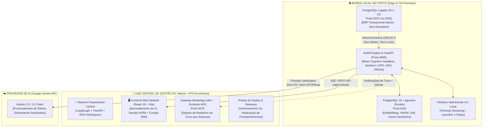
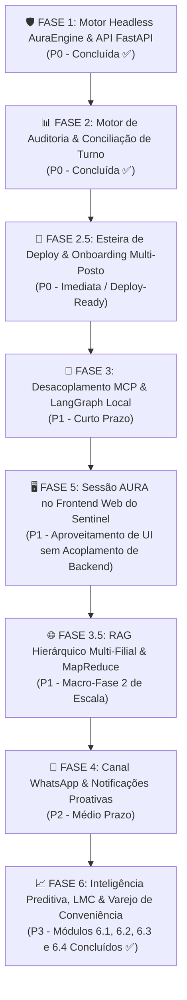

# 🚀 Roadmap Estratégico & Engenharia de Execução: Projeto AURA

**Projeto:** AURA (antigo Ai.la) — Autonomous Unified Retail Assistant (IA Especialista em Postos de Combustíveis e PDV)  
**Versão:** 1.7.0-PRO  
**Status Atual:** Motor Cognitivo Headless AURA Concluído (Fase 1 Headless Concluída ✅ via `core/aura_engine.py` e API FastAPI em `core/aura_api.py`) + 11 Ferramentas Analíticas do Posto Homologadas (Fases 1, 2, 6.1, 6.2, 6.3 e 6.4) + Roteador Semântico Vetorial + RAG Híbrido CDC Delta Hash  
**Próximas Frentes:** Fase 2.5 (Esteira de Deploy Automatizado & Onboarding Multi-Posto) $\rightarrow$ Fase 3 (MCP + LangGraph) $\rightarrow$ Fase 5 (Sessão AURA no Frontend Web React do Sentinel) $\rightarrow$ Fase 3.5 (RAG Hierárquico Multi-Filial & MapReduce)  
**Ambiente:** Edge AI Local (Postos) + Maestro Central de Gestão/Telemetria | Docker + PostgreSQL 16 (Portas 5432/5433, 5434, 5678, 8000)  

---

## 🧭 1. Visão Geral e Topologia Arquitetural Híbrida

A **AURA** foi concebida a partir de um princípio inegociável de engenharia de software e segurança: **o posto de combustível não pode parar e os dados dos clientes não podem vazar.**

Para viabilizar a escala do produto para dezenas ou centenas de postos com **custo zero de infraestrutura em nuvem** e **100% de blindagem LGPD**, o sistema adota uma **Topologia Híbrida Edge AI (Borda Local no Posto + Hub Central de Gestão)** com motor desacoplado headless.



---

### 🛡️ 1.1 Princípio Arquitetural de Desacoplamento: AURA vs SENTINEL

O ecossistema adota uma separação de domínios estrita e intencional: **duas inteligências autônomas, zero acoplamento de backend, reaproveitamento estratégico de frontend.**

1. **AURA (Autonomous Unified Retail Assistant):**
   - **Domínio:** Especialista exclusivo no **negócio** de postos de combustíveis e lojas de conveniência.
   - **Responsabilidades:** Auditoria contábil de turnos, conciliação de encerrantes (`fechabomba` $\leftrightarrow$ `fechacaixa` $\leftrightarrow$ Companytec CBC04), previsão de esgotamento de tanques (*run-out*), conformidade do LMC da ANP ($\pm 0.6\%$), auditoria de vazão de bicos/frentistas e inteligência de vendas cruzadas da conveniência (*Market Basket Analysis*).
   - **Arquitetura:** Processo autônomo e desacoplado operando via `AuraEngine` (`core/aura_engine.py`) e servido por sua própria API FastAPI assíncrona (`core/aura_api.py`).

2. **SENTINEL (N3 Agent Hub):**
   - **Domínio:** Especialista exclusivo na **engenharia de confiabilidade de TI** (SRE, suporte N3, incidentes de PDV travado, conectividade de autorizadores fiscais e concentradores).
   - **Responsabilidades:** Monitoramento de logs em tempo real, sandbox AST de SQL, runbooks de remediação de incidentes de infraestrutura.

3. **Diretriz de Integração (Zero Acoplamento de Inteligências no Backend):**
   - **Sem Mistura no Backend:** AURA e SENTINEL **NÃO têm integração de lógica nem dependência de backend**. Não compartilham modelos de LLM, prompts, grafos de agentes ou bases vetoriais. AURA opera 100% independente do Sentinel.
   - **Reaproveitamento do Frontend (Fase 5):** Em vez de desenvolver uma interface web do zero, a aplicação React 18 + Vite do Sentinel (`RAG WP/frontend`) é aproveitada como casca visual, recebendo uma **sessão/seção dedicada e rica para a AURA**, que consome exclusivamente a API da AURA (`/api/v1/aura/chat` e rotas analíticas) via requisições REST/SSE diretas.

---

### 🏛️ Pilares Arquiteturais Fundamentais

1. **Estratégia de Coexistência PostgreSQL (Zero-Disruption):**
   - **O Cenário Real:** A esmagadora maioria dos postos de combustíveis opera com ERPs legados consolidados há anos, rodando sobre PostgreSQL 9.5, 10 ou 12 no Windows. Essas versões são completamente incompatíveis com a extensão vetorial moderna `pgvector` (que requer PG 15+). Fazer upgrade de versão no banco do ERP é inviável comercialmente, pois quebraria o ERP legado e arriscaria travar as bombas de combustível e emissão de NFC-e.
   - **A Solução Zero-Disruption:** O ERP do cliente permanece intacto e soberano na porta padrão (`5432` ou `5433`). A AURA provisiona uma instância dedicada e isolada de **PostgreSQL 16 com pgvector via container Docker na porta `5434`**.
   - **Acesso Estritamente Read-Only:** A conexão da AURA com o banco do ERP é configurada exclusivamente com permissões de `SELECT`. O agente **nunca executa `INSERT`, `UPDATE`, `DELETE`, `ALTER TABLE` nem adquire travas de escrita** nas tabelas do ERP (`abastecimentos`, `fechabomba`, `fechacaixa`, `produtos`, `pedido`, etc.). O risco de corrupção ou indisponibilidade no ERP é estritamente zero.

2. **Topologia Híbrida Edge AI (100% LGPD Compliant & Custo Zero):**
   - **Processamento 100% Local no Posto:** RAG híbrido, vetorização, enriquecimento léxico e consultas de banco rodam diretamente no hardware já existente no posto.
   - **Latência Ultra-Baixa (<80ms):** Consultas ao catálogo e conciliações de turno ocorrem localmente sem round-trip desnecessário para data centers na nuvem.
   - **Blindagem LGPD Absoluta:** Dados de vendas, faturamento, identificação de frentistas e documentos de clientes jamais trafegam abertos pela internet. Antes de qualquer envio de prompt para a API do Google Gemini, a camada local `CentralLogSanitizer` ofusca deterministicamente 24 categorias de PII (CPFs validados, placas Mercosul, cartões TEF, telefones).
   - **Hub Central Leve:** O ambiente de gestão central (PC Marlon ou VPS econômica de baixo custo) atua como concentrador de versionamento de código, orquestrador Maestro de consultas de rede e gateway de WhatsApp via n8n.

3. **Isolamento Contextual por Posto (Tenant-Isolated RAG):**
   - Cada posto de combustível possui seu próprio banco vetorial isolado (`posto_ai` ou `posto_{tenant_id}`).
   - Não há compartilhamento de base vetorial entre postos distintos. Isso impede de forma categórica a contaminação de preços de combustíveis, políticas de desconto, cadastros de colaboradores ou catálogo de conveniência entre clientes concorrentes.

4. **Orquestração Headless com AuraEngine (`core/`):**
   - A AURA opera de forma desacoplada via `AuraEngine`, suportando streaming SSE token-a-token, persistência de sessões duráveis em SQLite WAL (`AuraSessionMemory`) e invocação direta de intenções analíticas sem custo de tokens.

5. **Topologia de Rede Distribuída: RAG Hierárquico Multi-Filial (MapReduce Fan-Out / Fan-In):**
   - Para donos e gestores de redes de postos, a AURA transcende o nó único local e opera como um ecossistema distribuído de alta eficiência de tokens e blindagem LGPD.
   - **O Maestro Central (LangGraph + FastAPI)** atua no Hub ou nuvem privada: recebe consultas executivas globais (*"Qual o status de estoque de gasolina comum de toda a rede?"*), divide a demanda e efetua um **Fan-Out assíncrono** com `asyncio` e HTTP/REST para os Edge Workers em contêineres Docker de todas as filiais simultaneamente.
   - **Os Edge Workers Locais** processam a consulta na borda: executam SQL read-only seguro no banco ERP local e no `pgvector` local, higienizam os dados com spaCy e retornam apenas um payload **JSON estruturado validado via Pydantic v2**, sem gerar texto livre prolixo.
   - **Resiliência e Tolerância a Falhas com SLA de 5s:** O Maestro opera com timeout estrito de 5 segundos e mecanismo de **Degradação Graciosa (Graceful Degradation)**: se um posto estiver sem internet, o sistema não sofre crash; consolida os postos online e adiciona uma flag informativa para a unidade inacessível.
   - **Fan-In e Síntese Executiva via LLM:** O Maestro agrega os JSONs recebidos e submete a um **Agente LLM Sintetizador** especializado, que ranqueia as filiais da mais crítica para a mais confortável e gera o parecer executivo consolidado com consumo mínimo de tokens.

```mermaid
flowchart TB
    USER["👤 Dono da Rede / Gestor Geral\nConsulta: 'Qual o status de estoque de gasolina de toda a rede?'"]

    subgraph HUB["🏢 NÓ CENTRAL / MAESTRO ORQUESTRADOR (LangGraph + FastAPI)"]
        MAESTRO["🎼 Maestro Orquestrador Central"]
        ROUTER{"Roteador de Escopo\n(Global vs Filial Específica?)"}
        DISPATCH["⚡ Fan-Out Assíncrono (asyncio)\nTimeout SLA: 5.0s | Concorrência Não-Bloqueante"]
        UNICAST["🎯 Despacho Unicast Direto\n(Bypassa Fan-Out da Rede)"]
        COLLECTOR["📥 Coletor de Payloads (Fan-In)\n+ Tratador de Nós Offline (Graceful Degradation)"]
        FALLBACK_HUB["🛡️ Fallback de Resiliência (Gerado no Hub)\n{'aviso': 'Filial Posto Sul offline, dados não incluídos.'}"]
        SYNTH["🤖 Agente Sintetizador Executivo (LLM)\n[Ranqueamento Crítico → Confortável | Economia >85% Tokens]"]
    end

    subgraph NETWORK["🌐 REDE DISTRIBUÍDA DE FILIAIS (Edge Computing On-Premises)"]
        subgraph POSTO1["⛽ Filial 01 - Posto Centro"]
            EDGE1["Worker Docker Local (FastAPI)\n• SQL Seguro (SELECT-only)\n• pgvector + ERP Local\n• Sanitização spaCy (LGPD)"]
            JSON1["Payload JSON Pydantic v2\n{'filial': 'Centro', 'combustivel': 'Gasolina Comum', 'status': 'Critico', 'autonomia_horas': 14}"]
        end

        subgraph POSTO2["⛽ Filial 02 - Posto Norte"]
            EDGE2["Worker Docker Local (FastAPI)\n• SQL Seguro (SELECT-only)\n• pgvector + ERP Local\n• Sanitização spaCy (LGPD)"]
            JSON2["Payload JSON Pydantic v2\n{'filial': 'Norte', 'combustivel': 'Gasolina Comum', 'status': 'Regular', 'autonomia_horas': 96}"]
        end

        subgraph POSTO3["⛽ Filial 03 - Posto Sul (Link Down / Sem Internet)"]
            EDGE3["Worker Docker Local (Inacessível / Timeout SLA 5s)"]
        end
    end

    USER --> MAESTRO
    MAESTRO --> ROUTER
    ROUTER -->|Escopo Global (Toda a Rede)| DISPATCH
    ROUTER -->|Escopo Local (Filial Única)| UNICAST

    DISPATCH -->|Async HTTP GET/POST| EDGE1
    DISPATCH -->|Async HTTP GET/POST| EDGE2
    DISPATCH -.->|Timeout 5s / Conexão Recusada| EDGE3
    UNICAST -->|Async HTTP GET/POST| EDGE1

    EDGE1 --> JSON1
    EDGE2 --> JSON2

    JSON1 --> COLLECTOR
    JSON2 --> COLLECTOR
    DISPATCH -.->|Injeção no SLA Expirado| FALLBACK_HUB
    FALLBACK_HUB --> COLLECTOR

    COLLECTOR --> SYNTH
    SYNTH -->|Relatório Gerencial Consolidado| USER
```

---

## 📊 2. Matriz de Priorização (Esforço x Impacto)

```
        ▲ ALTO
        │  [Fase 1: Sanitizador & AuraEngine] [Fase 2: Conciliação de Turnos]
        │  [Fase 2.5: Deploy Multi-Posto]     [Fase 5: Sessão AURA no Front Sentinel]
        │  [Fase 4: Alertas WhatsApp]         [Fase 3: Servidor MCP / LangGraph]
IMPACTO │                                     [Fase 3.5: RAG Multi-Filial MapReduce]
        │                                     [Fase 6: IA Preditiva & LMC]
        │
        └─────────────────────────────────────────────────────────────►
          BAIXO                     ESFORÇO                      ALTO
```

---

## 🗺️ 3. Fases do Roadmap em Ordem de Prioridade



---

## 🛠️ 4. Detalhamento Técnico das Fases

### 🛡️ FASE 1: Blindagem de Dados, LGPD & Motor Headless AuraEngine (Status: Concluída ✅)
> **Objetivo:** Garantir a blindagem estrita LGPD e desacoplar o cérebro cognitivo do terminal CLI, tornando a AURA uma biblioteca/serviço universal com suporte a streaming SSE e APIs REST.

- [x] **Módulo `CentralLogSanitizer` (Pré-Prompt & In-Tool):**
  - Interceptor regex e heurístico de 24 categorias implementado em `core/sanitizer.py`.
  - Ofuscação dinâmica ativa:
    - **Placas de Veículos:** Padrão Mercosul e antigas $\rightarrow$ `[REDACTED:PLACA]`.
    - **CPFs e CNPJs:** Validação algorítmica de DV oficial da Receita Federal $\rightarrow$ `[REDACTED:CPF]` e `[REDACTED:CNPJ]`.
    - **Telefones de Fidelidade:** KMV, ShellBox, Premmia $\rightarrow$ `[REDACTED:PHONE]`.
    - **Cartões e TEF:** 13 a 16 dígitos com formato de trilha TEF $\rightarrow$ `[REDACTED:CREDIT_CARD]`.
    - **OWASP GenAI 2026:** Injeções de prompt indiretas neutralizadas com `[NEUTRALIZED_PROMPT_INJECTION_OWASP_ACS]`.
- [x] **Motor Cognitivo Desacoplado `AuraEngine` (`core/aura_engine.py`):**
  - Orquestração completa de streaming token-a-token via SSE (`AuraChunk`, `AuraChunkType`).
  - Memória de sessão persistente em SQLite WAL (`AuraSessionMemory`) com suporte multi-filial e multi-tenant.
  - Execução direta de ferramentas analíticas sem custo de tokens (`execute_tool_direct` e `execute_tool`).
- [x] **Endpoints HTTP FastAPI (`core/aura_api.py`):**
  - `POST /api/v1/aura/chat` (streaming SSE e resposta completa).
  - `POST /api/v1/aura/execute-intent` (invocação direta analítica).
  - `GET /api/v1/aura/stations` (saúde de conexão ERP e pgvector das filiais).
  - `GET /api/v1/aura/health` (prontidão operacional).
- [x] **Entregáveis da Fase 1:**
  - `core/sanitizer.py` (motor de sanitização unificado com spaCy NLP e regex).
  - `core/aura_engine.py` e `core/aura_api.py` (motor cognitivo headless e rotas FastAPI).
  - `scripts/test_aura_engine.py` (suíte de testes automatizada com 100% de aprovação).

---

### 📊 FASE 2: Motor de Conciliação de Turnos & Auditoria de Pista (Status: Concluída ✅)
> **Objetivo:** Cruzar o faturamento de caixa com os encerrantes das bombas e os níveis dos tanques, respondendo a pergunta de ouro do dono do posto: *"O caixa bateu com o que saiu dos bicos?"*

- [x] **Mapeamento e Triangulação SQL:**
  - Query analítica de alta performance cruzando em tempo real:
    1. **Automação Companytec CBC04 (`abastecimentos`):** Volume real faturado, encerrantes inicial (`ei`) e final (`encerrante`) da automação.
    2. **Fechamento de Pista (`fechabomba`):** Cálculo de volume bruto e faturado com suporte a virada de hodômetro mecânico/digital (rollover em 100k, 1M, 10M), detecção de erros de leitura e desconto de aferições do Inmetro (`qtdeaf`).
    3. **Fechamento de Caixa (`fechacaixa` & `funcionarios`):** Valores declarados em dinheiro (`valdinh`), cartão (`valcart`), a prazo (`valnotpra`), convênio/cheque (`valcheconv`, `valchevis`, `valchepre`), vinculados ao operador e caixa.
    4. **Pedidos PDV (`pedido`):** Cupons fiscais emitidos para fechamentos em andamento ou conferência em tempo real.
- [x] **Detecção de Quebras e Furos:**
  - Alerta de Divergência de Pista: Diferença entre encerrante mecânico/manual e telemetria da automação CBC04.
  - Alerta de Furo ou Sobra de Caixa: Comparação contábil rigorosa entre valores declarados e faturamento da pista.
  - Balanço de Tanques e Regra ANP: Monitoramento volumétrico dos tanques contra tolerância legal de $\pm 0.6\%$.
- [x] **Nova Ferramenta do Agente (`auditar_fechamento_turno`):**
  - Implementada em `core/tools.py` com normalizadores robustos de turno e data.
  - Roteamento e streaming integrados em `main.py` e `core/aura_engine.py`.
- [x] **Entregáveis da Fase 2:**
  - `core/tools.py` atualizado com método `auditar_fechamento_turno()`.
  - `scripts/test_conciliacao_turno.py` suíte completa de testes com 100% de aprovação.

---

### 📦 FASE 2.5: Esteira de Deploy Automatizado & Onboarding Multi-Posto (Prioridade P0 - Imediata / Deploy-Ready)
> **Objetivo:** Padronizar a instalação da AURA para novos postos em procedimento de 1-clique, garantindo coexistência harmônica com qualquer versão de ERP legado (PostgreSQL 9.5 / 12) sem necessidade de suporte técnico avançado no local.

- [ ] **Pacote de Containerização Docker Compose (`docker-compose.yml`):**
  - Imagem oficial otimizada: `pgvector/pgvector:pg16`.
  - Mapeamento de portas seguro: Exposição do pgvector na porta `5434` do host, eliminando colisão com a porta `5432`/`5433` do ERP.
  - Persistência em volume Docker nomeado (`aura_pgvector_posto_data`).
  - *Tuning* de performance para máquinas de postos (4GB a 16GB RAM):
    ```yaml
    command: >
      postgres
        -c shared_buffers=256MB
        -c work_mem=16MB
        -c maintenance_work_mem=64MB
        -c max_connections=50
    ```
- [ ] **Script de Implantação Automatizada em 1-Clique (`scripts/deploy_posto.ps1`):**
  - Checagem de pré-requisitos (Docker Engine ativo, Python 3.10+).
  - Teste de conectividade TCP no ERP legado (`5432`/`5433`) e liberação da porta `5434`.
  - Subida do container pgvector e migração de schema com tabelas vetoriais.
  - Carga inicial de catálogo e checagem de saúde operacional.
- [ ] **Entregáveis da Fase 2.5:**
  - `docker-compose.yml` (template oficial na raiz do projeto).
  - `scripts/deploy_posto.ps1` (orquestrador de implantação em PowerShell idempotente).
  - Documentação de onboarding rápido para equipes de campo.

---

### 🔌 FASE 3: Desacoplamento MCP & Orquestração LangGraph Local (Prioridade P1 - Curto Prazo)
> **Objetivo:** Complementar a API FastAPI já existente com suporte ao protocolo MCP e orquestração agêntica de múltiplos passos via LangGraph.

- [ ] **Orquestrador Multi-Agente com LangGraph Local (`core/langgraph_agent.py`):**
  - Implementação de StateGraph local para controle de estado e raciocínio multi-etapas:
    - **Roteador Semântico:** Classifica complexidade da demanda.
    - **Agente de Pista & Tanques:** Focado em telemetria volumétrica e normas ANP.
    - **Agente de Caixa & PDV:** Focado em vendas, sangrias e conciliação contábil.
    - **Sintetizador Executivo:** Consolida achados em linguagem natural simples e acionável.
- [ ] **Servidor MCP Local AURA (`server/mcp_server.py`):**
  - Exposição das 11 ferramentas analíticas via Model Context Protocol JSON-RPC:
    - `consultar_catalogo_produtos`
    - `consultar_vendas_pdv`
    - `prever_esgotamento_tanques`
    - `auditar_fechamento_turno`
    - `auditar_desempenho_pista_frentistas`
    - `gerar_relatorio_lmc_anp`
    - `auditar_cesta_conveniencia_vendas_cruzadas`
- [ ] **Entregáveis da Fase 3:**
  - `core/langgraph_agent.py` (Grafo de estados e orquestrador agêntico).
  - `server/mcp_server.py` (Servidor MCP local).

---

### 🖥️ FASE 5: Sessão AURA no Frontend Web do Sentinel & Mobile PWA (Prioridade P1 - Frontend Unificado)
> **Objetivo:** Em vez de desenvolver um frontend do zero em Next.js, **reaproveitar a aplicação React 18 + Vite já homologada do Sentinel** (`C:\Users\Marlon\Documents\RAG WP\frontend`), adicionando uma **Sessão / Seção Exclusiva para a AURA**, consumindo a API desacoplada `core/aura_api.py`. **Zero acoplamento de backend entre as inteligências.**

- [ ] **Sessão AURA na Navegação do Sentinel (`frontend/src/components/layout/AppSidebar.tsx`):**
  - Novo item de navegação no menu lateral: `"AURA | Inteligência de Posto"` (ícone `Bot` ou `Sparkles`), com status `IA RETAIL`.
- [ ] **Workspace Dedicado da AURA (`frontend/src/components/aura/AuraWorkspaceView.tsx`):**
  - **Interface Conversacional com Streaming SSE:**
    - Conexão nativa com `POST /api/v1/aura/chat` (Server-Sent Events).
    - Exibição de chunks token-a-token, renderização rica em Markdown e formatação de dados analíticos.
  - **Seletor de Postos e Monitor de Saúde:**
    - Consumo de `GET /api/v1/aura/stations` e `GET /api/v1/aura/health`.
    - Indicador visual em tempo real: status da conexão com PostgreSQL ERP (5433), Docker pgvector (5434) e latência de rede.
  - **Cockpit de Disparo em 1-Clique das 11 Ferramentas Analíticas:**
    - Cards acionáveis conectados a `POST /api/v1/aura/execute-intent`:
      - 📊 **LMC Oficial ANP:** Balanço volumétrico com tolerância $\pm 0.6\%$.
      - ⛽ **Run-Out Forecast:** Autonomia de tanques e sugestão de caminhão (bocas de 5k).
      - 💰 **Conciliação de Turno:** Furos de caixa e divergência CBC04.
      - 🛒 **Market Basket Analysis:** Regras de associação e combos da conveniência.
      - 👨‍💼 **Performance de Frentistas:** Conversão de aditivada e bicos com filtro lento (< 25-30 L/min).
- [ ] **Arquitetura 100% Desacoplada (Frontend Unificado, Backend Isolado):**
  - O frontend do Sentinel simplesmente realiza requisições HTTP para a URL da AURA (ex: `http://localhost:8000/api/v1/aura` ou via proxy Vite).
  - O backend do Sentinel não processa dados de turnos ou combustíveis; o backend da AURA não processa logs de TI ou SRE.
- [ ] **Empacotamento Mobile (PWA):**
  - Configuração como Progressive Web App (PWA) instalável diretamente no smartphone/tablet do gestor do posto.
- [ ] **Entregáveis da Fase 5:**
  - Componente `AuraWorkspaceView.tsx` e atalho lateral no frontend do Sentinel.
  - Testes de integração do streaming SSE no navegador.

---

### 🌐 FASE 3.5: Escalabilidade de Rede Multi-Filial — RAG Hierárquico Distribuído & MapReduce (Macro-Fase 2 de Escala)
> **Objetivo:** Permitir que donos e diretores de redes de postos façam consultas globais em linguagem natural (ex: *"Qual o status de estoque de gasolina comum de toda a rede?"*) e recebam um relatório gerencial consolidado via MapReduce (Fan-Out / Fan-In), economizando >85% de tokens com blindagem LGPD.

- [ ] **1. O Maestro (Agente Orquestrador Central):**
  - Roteamento determinístico entre consulta local e consulta de rede global.
  - Fan-Out assíncrono com `asyncio.gather` e `httpx` para os contêineres Docker de todas as filiais simultaneamente.
- [ ] **2. Edge Computing nos Postos:**
  - Execução na borda com SQL seguro (`SELECT`-only) e retorno em payload enxuto Pydantic JSON (sem texto livre prolixo).
- [ ] **3. Resiliência & Degradação Graciosa:**
  - SLA rígido de 5.0 segundos: postos offline não derrubam a rede; são consolidados com aviso de contingência.
- [ ] **4. O Agente Sintetizador (Fan-In via LLM):**
  - Agrupamento dos JSONs e síntese gerencial executiva ordenando da filial mais crítica para a mais confortável.
- [ ] **Entregáveis da Fase 3.5:**
  - [x] `core/schemas/network.py` (Contratos Pydantic v2 — Concluído ✅).
  - [x] `scripts/test_rag_hierarquico.py` (Simulação de 50 filiais em asyncio — 100% de Aprovação ✅).
  - [ ] `core/network_orchestrator.py` (Maestro com despacho assíncrono Fan-Out).
  - [ ] `core/synthesizer.py` (Agente Sintetizador executivo).

---

### 📱 FASE 4: Canal WhatsApp & Notificações Proativas (Prioridade P2 - Médio Prazo)
> **Objetivo:** O gestor do posto é notificado proativamente no WhatsApp ao final de cada turno e pode enviar comandos por texto ou áudio.

- [ ] **Orquestração via `n8n_aila` (Porta 5678):**
  - Conectar o n8n ao webhook da Evolution API (WhatsApp) e ao backend FastAPI da AURA (`POST /api/v1/aura/chat`).
- [ ] **Automação de Relatórios Agendados (Cron Jobs):**
  - Envio automático dos fechamentos de turno (06:05, 14:05, 22:05).
- [ ] **Gatilhos de Alertas Críticos no WhatsApp:**
  - Tanque com saldo crítico ($< 15\%$), caixa com acúmulo de dinheiro (sangria) ou furo de pista CBC04.
- [ ] **Entregáveis da Fase 4:**
  - Fluxos do n8n exportados em `.json`.

---

### 📈 FASE 6: Inteligência Preditiva & Varejo de Posto (Status: Concluída ✅)
> **Objetivo:** Dotar a AURA de motores matemáticos, fiscais e preditivos de alta precisão com zero alucinação.

- [x] **Previsão de Esgotamento de Combustível (Run-Out Forecast) & Sugestão Inteligente de Pedidos (Concluído ✅):**
  - Implementado em `core/tools.py` via `PostoTools.prever_esgotamento_tanques()`.
  - Autonomia em horas e dias com reserva crítica de 15%: $\text{Autonomia} = \frac{\text{Saldo Atual} - \text{Estoque Crítico (15%)}}{\text{Consumo Médio Diário}}$.
  - Cálculo de espaço livre para descarga (*ullage*) e sugestão de compras em múltiplos de 5.000 L.
  - Testado em `scripts/test_previsao_tanques.py` com 100% de aprovação.
- [x] **Auditoria Operacional de Pista & Desempenho de Frentistas (Concluído ✅):**
  - Implementado em `core/tools.py` via `PostoTools.auditar_desempenho_pista_frentistas()`.
  - Detecção de bicos com vazão lenta (< 25-30 L/min, alerta de filtro sujo da bomba).
  - Ranking de operadores, ticket médio e índice de conversão de Gasolina Aditivada.
  - Testado em `scripts/test_desempenho_frentistas.py` com 100% de aprovação.
- [x] **Roteador Semântico Vetorial com pgvector (Concluído ✅):**
  - Implementado em `core/semantic_router.py` via classe `SemanticRouter`.
  - Tabela `intencoes_vetores` no pgvector (porta 5434) com `halfvec(768)` e HNSW. Latência sub-5ms e cache LRU.
- [x] **Otimização Extrema do RAG Híbrido & CDC Delta Hash (Concluído ✅):**
  - Change Data Capture com hash MD5 em `produtos_vetores` (redução de >95% de API).
  - RRF calibrado com boost de código de barras (+1.0) e viscosidades de lubrificantes (+0.08).
- [x] **Automação do LMC Oficial da ANP (Portaria 26/1992 - Concluído ✅):**
  - Implementado em `core/tools.py` via `PostoTools.gerar_relatorio_lmc_anp()`.
  - Estoque escriturado $E_e = E_a + R - V$, variação volumétrica e tolerância legal de $\pm 0.6\%$.
  - Testado em `scripts/test_lmc_anp.py` com 100% de aprovação.
- [x] **Motor de Inteligência de Loja de Conveniência: Market Basket Analysis & Vendas Cruzadas (Concluído ✅):**
  - Implementado em `core/tools.py` via `PostoTools.auditar_cesta_conveniencia_vendas_cruzadas()`.
  - Regras de associação Apriori: Suporte, Confiança, Lift ($\ge 2.0$), Convicção e scripts de venda para o operador de PDV.
  - Testado em `scripts/test_conveniencia_vendas_cruzadas.py` com 100% de aprovação.

---

## 📅 5. Cronograma Executivo Estimado

| Sprint | Duração | Foco Principal | Resultado Entregável |
| :---: | :---: | :--- | :--- |
| **Sprint 1** | Semanas 1 e 2 | **Fases 1 e 2 (Concluídas ✅)** | Sanitizador LGPD + AuraEngine Headless com FastAPI SSE + Conciliação de turno (`fechabomba` $\leftrightarrow$ `fechacaixa` $\leftrightarrow$ CBC04) homologados com 100% de aprovação. |
| **Sprint 1.5** | Semanas 2 e 3 | **Fase 6 Analítica (Concluída ✅)** | Run-Out Forecast (6.1) + Auditoria de Pista/Frentistas (6.2) + LMC ANP (6.3) + Market Basket Conveniência (6.4) + Roteador pgvector e RAG CDC homologados. |
| **Sprint 2** | Semanas 3 e 4 | **Fase 2.5 (Deploy-Ready) & Fase 3** | Template `docker-compose.yml` + Script `deploy_posto.ps1` de onboarding em 1-clique + Servidor MCP local e LangGraph local. |
| **Sprint 2.5** | Semanas 4 e 5 | **Fase 5 (Frontend Unificado)** | **Sessão AURA no Frontend Web do Sentinel (`RAG WP/frontend`)**: Chat SSE token-a-token, seletor de postos e cockpit analítico em 1-clique sem acoplamento de backend. |
| **Sprint 3** | Semanas 5 e 6 | **Fase 3.5 & Fase 4** | RAG Hierárquico Multi-Filial (Maestro Fan-Out + Edge Workers Docker + Sintetizador MapReduce) + n8n WhatsApp disparando relatórios de turno. |

---

## 🎯 6. Próximo Passo Recomendado

Com o **Motor Cognitivo Headless AURA (Fase 1)** e todas as **ferramentas analíticas da Fase 6** plenamente consolidados e testados com 100% de aprovação:

A esteira de execução está posicionada para:
1. **Fase 2.5: Esteira de Deploy Automatizado (`docker-compose.yml` e `deploy_posto.ps1`)**: Garantir que o container pgvector suba liso em qualquer posto cliente.
2. **Fase 5: Sessão AURA no Frontend do Sentinel (`RAG WP/frontend`)**: Criar a aba e componentes dedicados da AURA no frontend React do Sentinel, conectando ao endpoint SSE `POST /api/v1/aura/chat` e rotas de estações.
