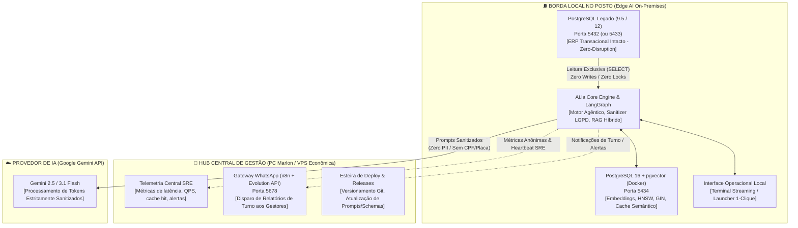
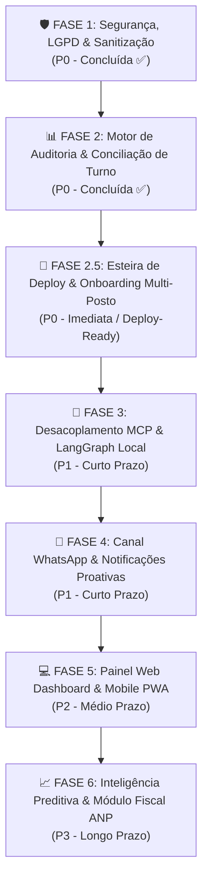

# 🚀 Roadmap Estratégico & Engenharia de Execução: Projeto Ai.la

**Projeto:** Ai.la — IA Local Especialista em Postos de Combustíveis e PDV  
**Versão:** 1.2.0-PRO  
**Status Atual:** Fases 1 e 2 Concluídas + Capacidade Preditiva da Fase 6 Homologada (LGPD + Conciliação de Turnos + Previsão de Esgotamento & Sugestão de Pedidos)  
**Próxima Frente Imediata:** Fase 2.5 (Esteira de Deploy Automatizado & Onboarding Multi-Posto) $\rightarrow$ Fase 3 (MCP + LangGraph)  
**Ambiente:** Edge AI Local (Posto) + Hub Central de Gestão/Telemetria | Docker + PostgreSQL 16 (Portas 5432/5433, 5434, 5678)  

---

## 🧭 1. Visão Geral e Topologia Arquitetural Híbrida

O **Ai.la** foi concebido a partir de um princípio inegociável de engenharia de software e segurança: **o posto de combustível não pode parar e os dados dos clientes não podem vazar.**

Para viabilizar a escala do produto para dezenas ou centenas de postos com **custo zero de infraestrutura em nuvem** e **100% de blindagem LGPD**, o sistema adota uma **Topologia Híbrida Edge AI (Borda Local no Posto + Hub Central de Gestão)**.



### 🏛️ Pilares Arquiteturais Fundamentais

1. **Estratégia de Coexistência PostgreSQL (Zero-Disruption):**
   - **O Cenário Real:** A esmagadora maioria dos postos de combustíveis opera com ERPs legados consolidados há anos, rodando sobre PostgreSQL 9.5, 10 ou 12 no Windows. Essas versões são completamente incompatíveis com a extensão vetorial moderna `pgvector` (que requer PG 15+). Fazer upgrade de versão no banco do ERP é inviável comercialmente, pois quebraria o ERP legado e arriscaria travar as bombas de combustível e emissão de NFC-e.
   - **A Solução Zero-Disruption:** O ERP do cliente permanece intacto e soberano na porta padrão (`5432` ou `5433`). O Ai.la provisiona uma instância dedicada e isolada de **PostgreSQL 16 com pgvector via container Docker na porta `5434`**.
   - **Acesso Estritamente Read-Only:** A conexão do Ai.la com o banco do ERP é configurada exclusivamente com permissões de `SELECT`. O agente **nunca executa `INSERT`, `UPDATE`, `DELETE`, `ALTER TABLE` nem adquire travas de escrita** nas tabelas do ERP (`abastecimentos`, `fechabomba`, `fechacaixa`, `produtos`, `pedido`, etc.). O risco de corrupção ou indisponibilidade no ERP é estritamente zero.

2. **Topologia Híbrida Edge AI (100% LGPD Compliant & Custo Zero):**
   - **Processamento 100% Local no Posto:** RAG híbrido, vetorização, enriquecimento léxico e consultas de banco rodam diretamente no hardware já existente no posto.
   - **Latência Ultra-Baixa (<80ms):** Consultas ao catálogo e conciliações de turno ocorrem localmente sem round-trip desnecessário para data centers na nuvem.
   - **Blindagem LGPD Absoluta:** Dados de vendas, faturamento, identificação de frentistas e documentos de clientes jamais trafegam abertos pela internet. Antes de qualquer envio de prompt para a API do Google Gemini, a camada local `CentralLogSanitizer` ofusca deterministicamente 24 categorias de PII (CPFs validados, placas Mercosul, cartões TEF, telefones).
   - **Hub Central Leve:** O ambiente de gestão central (PC Marlon ou VPS econômica de baixo custo) atua exclusivamente como concentrador de telemetria SRE anônima (saúde e performance), versionador de código e gateway de WhatsApp via n8n.

3. **Isolamento Contextual por Posto (Tenant-Isolated RAG):**
   - Cada posto de combustível possui seu próprio banco vetorial isolado (`posto_ai` ou `posto_{tenant_id}`).
   - Não há compartilhamento de base vetorial entre postos distintos. Isso impede de forma categórica a contaminação de preços de combustíveis, políticas de desconto, cadastros de colaboradores ou catálogo de conveniência entre clientes concorrentes.

4. **Orquestração com LangGraph Local na Borda (`core/`):**
   - Para queries simples de busca e catálogo, o Ai.la utiliza o motor `HybridRAGEngine` em rota direta de alta velocidade.
   - Para operações complexas de auditoria, conciliação e diagnóstico de pista, a orquestração multi-agente é gerenciada localmente via **LangGraph** estruturado na pasta `core/`:
     - **Nó 1 (Parser & Sanitizer):** Normalização de data/turno e expurgo de injeções OWASP / dados PII.
     - **Nó 2 (SQL Data Gathering):** Coleta paralela de `fechabomba`, `fechacaixa` e telemetria da Companytec CBC04.
     - **Nó 3 (Auditor Matemático & ANP):** Aplicação de fórmulas de encerrante, rollover de hodômetro e regra volumétrica de $\pm 0.6\%$.
     - **Nó 4 (Diagnóstico SRE & Parecer Executivo):** Formatação com streaming token-a-token para o gestor.

---

## 📊 2. Matriz de Priorização (Esforço x Impacto)

```
        ▲ ALTO
        │  [Fase 1: Sanitizador LGPD]       [Fase 2: Conciliação de Turnos]
        │  [Fase 2.5: Deploy Multi-Posto]   [Fase 3: Servidor MCP / LangGraph]
        │  [Fase 4: Alertas WhatsApp]       [Fase 6: IA Preditiva & LMC]
IMPACTO │
        │  [Fase 5: Dashboard Web PWA]      
        │
        └─────────────────────────────────────────────────────────────►
          BAIXO                     ESFORÇO                      ALTO
```

---

## 🗺️ 3. Fases do Roadmap em Ordem de Prioridade



---

## 🛠️ 4. Detalhamento Técnico das Fases

### 🛡️ FASE 1: Blindagem de Dados, LGPD & Camada de Sanitização (Status: Concluída ✅)
> **Objetivo:** Garantir que o envio de prompts para modelos externos (Google Gemini) nunca contenha dados que identifiquem clientes ou veículos, cumprindo integralmente a LGPD e evitando riscos jurídicos.

- [x] **Módulo `CentralLogSanitizer` (Pré-Prompt & In-Tool):**
  - Interceptor regex e heurístico de 24 categorias implementado em `core/sanitizer.py`.
  - Ofuscação dinâmica ativa:
    - **Placas de Veículos:** Padrão Mercosul e antigas $\rightarrow$ `[REDACTED:PLACA]`.
    - **CPFs e CNPJs:** Validação algorítmica de DV oficial da Receita Federal $\rightarrow$ `[REDACTED:CPF]` e `[REDACTED:CNPJ]`.
    - **Telefones de Fidelidade:** KMV, ShellBox, Premmia $\rightarrow$ `[REDACTED:PHONE]`.
    - **Cartões e TEF:** 13 a 16 dígitos com formato de trilha TEF $\rightarrow$ `[REDACTED:CREDIT_CARD]`.
    - **OWASP GenAI 2026:** Injeções de prompt indiretas neutralizadas com `[NEUTRALIZED_PROMPT_INJECTION_OWASP_ACS]`.
- [x] **Entregáveis da Fase 1:**
  - `core/sanitizer.py` (motor de sanitização unificado com spaCy NLP e regex).
  - `scripts/test_sanitizer.py` (suíte de testes automatizada com 100% de aprovação).
  - Integração nativa em `main.py` (telemetria e pré-prompt) e `core/tools.py` (`sanitize_dict`).

---

### 📊 FASE 2: Motor de Conciliação de Turnos & Auditoria de Pista (Status: Concluída ✅)
> **Objetivo:** Cruzar o faturamento de caixa com os encerrantes das bombas e os níveis dos tanques, respondendo a pergunta de ouro do dono do posto: *"O caixa bateu com o que saiu dos bicos?"*

- [x] **Mapeamento e Triangulação SQL:**
  - Query analítica de alta performance cruzando em tempo real:
    1. **Automação Companytec CBC04 (`abastecimentos`):** Volume real faturado, encerrantes inicial (`ei`) e final (`encerrante`) da automação.
    2. **Fechamento de Pista (`fechabomba`):** Cálculo de volume bruto e faturado com suporte a virada de hodômetro mecânico/digital (rollover em 100k, 1M, 10M), detecção de erros de leitura e desconto de aferições do Inmetro (`qtdeaf`).
    3. **Fechamento de Caixa (`fechacaixa` & `funcionarios`):** Valores declarados em dinheiro (`valdinh`), cartão (`valcart`), a prazo (`valnotpra`), convênio/cheque (`valcheconv`, `valchevis`, `valchepre`), vinculados ao operador e caixa.
    4. **Pedidos PDV (`pedido`):** Cupons fiscais emitidos para fechamentos em andamento ou conferência em tempo real.
- [x] **Detecção de Quebras e Furos:**
  - Alerta de Divergência de Pista: Diferença entre encerrante mecânico/manual e telemetria da automação CBC04.
  - Alerta de Furo ou Sobra de Caixa: Comparação contábil rigorosa entre valores declarados e faturamento da pista (diferenciando turnos em andamento com caixas abertos de furos consolidados).
  - Balanço de Tanques e Regra ANP: Monitoramento volumétrico dos tanques contra tolerância legal de $\pm 0.6\%$ sobre a movimentação física quando há leitura de régua/sonda no turno.
- [x] **Nova Ferramenta do Agente (`auditar_fechamento_turno`):**
  - Implementada em `core/tools.py` com normalizadores robustos de turno (`1º TURNO`, `2º TURNO`, `3º TURNO`, `manhã`, `tarde`, `noite`, `madrugada`) e data (ISO, BR, DD/MM, extenso, "hoje", "ontem", "anteontem") com proteção contra SQL syntax error.
  - Roteamento e intenção `auditoria_turno` integrados em `main.py` com streaming token-a-token e parecer executivo.
- [x] **Entregáveis da Fase 2:**
  - `core/tools.py` atualizado com método `auditar_fechamento_turno()`, método `calcular_volume_encerrante()` com suporte a rollover, e proteção `sanitize_dict`.
  - `main.py` atualizado com classificador abrangente de intenções operacionais, extrator resiliente de linguagem natural e diretrizes no prompt de sistema.
  - `scripts/test_conciliacao_turno.py` suíte completa de testes unitários e de integração com 100% de aprovação.

---

### 📦 FASE 2.5: Esteira de Deploy Automatizado & Onboarding Multi-Posto (Planejamento Futuro / Na Esteira)
> **Objetivo:** Documentação de diretriz arquitetural para quando a estrutura do projeto estiver consolidada. Padronizar a instalação do Ai.la para novos postos em procedimento de 1-clique, garantindo coexistência harmônica com qualquer versão de ERP legado (PostgreSQL 9.5 / 12) sem necessidade de suporte técnico avançado no local.

- [ ] **Pacote de Containerização Docker Compose (`docker-compose.yml` - A ser criado futuramente):**
  - Imagem oficial otimizada: `pgvector/pgvector:pg16`.
  - Mapeamento de portas seguro: Exposição do pgvector na porta `5434` do host (mapeada para `5432` interna do container), eliminando qualquer colisão com o PostgreSQL do ERP (que roda na porta `5432` ou `5433`).
  - Persistência em volume Docker nomeado (`aila_pgvector_posto_data`).
  - *Tuning* de performance para máquinas de borda de postos (4GB a 16GB RAM):
    ```yaml
    command: >
      postgres
        -c shared_buffers=256MB
        -c work_mem=16MB
        -c maintenance_work_mem=64MB
        -c max_connections=50
    ```
  - Healthcheck nativo via `pg_isready` para inicialização determinística.

- [ ] **Script de Implantação Automatizada em 1-Clique (`scripts/deploy_posto.ps1` - A ser implementado futuramente):**
  - Pipeline planejado em fases executivas:
    1. **Checagem de Pré-requisitos:** Validação de Docker Engine / Docker Desktop ativo e Python 3.10+.
    2. **Diagnóstico e Verificação de Portas:** Teste de conectividade TCP no ERP legado (`5432`/`5433`) e confirmação de liberação da porta `5434`.
    3. **Subida da Instância Isolada:** Execução automatizada de `docker compose up -d`.
    4. **Healthcheck e Sincronismo:** Loop de prontidão até confirmação de conexões ativas pelo PostgreSQL 16.
    5. **Inicialização de Extensões e Migração de Schema:** Ativação automática de `CREATE EXTENSION IF NOT EXISTS vector;` e criação determinística das tabelas `produtos_vetores` (com índices HNSW + GIN) e `perguntas_cache`.
    6. **Indexação Inicial e Healthcheck SRE:** Carga inicial de catálogo e validação de prontidão SRE.

- [ ] **Configuração e Isolamento Parametrizado por Tenant:**
  - Parametrização via `.env` para cada posto implantado:
    ```env
    TENANT_ID=posto_alphaville_01
    POSTO_NOME="Posto Alphaville Matriz"
    ERP_DB_HOST=localhost
    ERP_DB_PORT=5432
    ERP_DB_NAME=posto
    ERP_DB_USER=suporte
    ERP_DB_PASSWORD=xxxxxx
    VECTOR_DB_HOST=localhost
    VECTOR_DB_PORT=5434
    VECTOR_DB_NAME=posto_ai
    ```

- [ ] **Entregáveis Planejados para a Fase 2.5:**
  - `docker-compose.yml` (template oficial na raiz do projeto).
  - `scripts/deploy_posto.ps1` (orquestrador de implantação em PowerShell idempotente).
  - `sql/schema_pgvector.sql` (schema DDL com extensão pgvector, índices HNSW e GIN).
  - Documentação de onboarding rápido para equipes de campo.

---

### 🔌 FASE 3: Desacoplamento MCP, API FastAPI & Orquestração LangGraph Local (Prioridade P1 - Curto Prazo)
> **Objetivo:** Tirar a IA do terminal e transformá-la em um microsserviço assíncrono padrão da indústria com orquestração agêntica multi-passos, permitindo que Web, Mobile e WhatsApp acessem exatamente o mesmo cérebro.

- [ ] **Orquestrador Multi-Agente com LangGraph Local (`core/langgraph_agent.py`):**
  - Implementação de StateGraph local para controle de estado e raciocínio multi-etapas:
    - **Roteador Semântico:** Classifica se a requisição é busca direta, cálculo matemático, auditoria de turno ou diagnóstico de telemetria.
    - **Agente de Pista & Tanques:** Focado em telemetria volumétrica e normas ANP.
    - **Agente de Caixa & PDV:** Focado em vendas, sangrias e conciliação contábil.
    - **Sintetizador Executivo:** Consolida achados em linguagem natural simples, objetiva e acionável para o dono do posto.
- [ ] **Servidor MCP Local Ai.la (`server/mcp_server.py`):**
  - Implementar um servidor Model Context Protocol local em Python expondo via JSON-RPC:
    - Tool `consultar_catalogo_produtos`
    - Tool `consultar_vendas_pdv`
    - Tool `consultar_estoque_tanques`
    - Tool `auditar_fechamento_turno`
    - Tool `telemetria_sre_banco`
- [ ] **Backend Web API (FastAPI):**
  - Criar camada de rotas HTTP REST + Server-Sent Events (SSE):
    - `POST /api/chat`: Transmissão de tokens via streaming para interfaces web/mobile.
    - `GET /api/relatorios/turno`: Endpoint rápido de fechamento consolidado.
    - `GET /api/sre/health`: Healthcheck do PostgreSQL ERP, pgvector e n8n.
- [ ] **Entregáveis da Fase 3:**
  - `core/langgraph_agent.py` (Grafo de estados e orquestrador agêntico).
  - `server/api.py` (FastAPI assíncrono).
  - `server/mcp_server.py` (Servidor MCP local).

---

### 📱 FASE 4: Canal WhatsApp & Notificações Proativas (Prioridade P1 - Curto Prazo)
> **Objetivo:** O gestor do posto não precisa abrir um aplicativo para ser informado. A IA o notifica proativamente no WhatsApp ao final de cada turno e responde perguntas em linguagem natural por texto ou áudio.

- [ ] **Orquestração via `n8n_aila` (Porta 5678):**
  - Conectar o n8n ao webhook da Evolution API (WhatsApp) e ao backend da IA Ai.la.
  - Implementar transição de áudio para texto (Whisper ou Gemini Audio) para o gestor poder mandar mensagens de voz diretamente da pista.
- [ ] **Automação de Relatórios Agendados (Cron Jobs):**
  - Envio automático dos fechamentos de turno nos horários padrão do posto:
    - **06:05:** Resumo executivo do 3º turno (noite).
    - **14:05:** Resumo executivo do 1º turno (manhã).
    - **22:05:** Resumo executivo do 2º turno (tarde).
- [ ] **Gatilhos de Alertas Críticos no WhatsApp:**
  - Tanque com saldo crítico ($< 15\%$ da capacidade).
  - Caixa com acúmulo de dinheiro acima do limite seguro (sugestão imediata de sangria de caixa).
  - Bico com divergência de encerrante detectada entre automação CBC04 e medição manual.
- [ ] **Entregáveis da Fase 4:**
  - Fluxos do n8n exportados em `.json`.
  - Disparador de mensagens de WhatsApp com formatação executiva (emojis, tabelas limpas e destaques de furos/quebras).

---

### 💻 FASE 5: Painel Web Dashboard & Mobile PWA (Prioridade P2 - Médio Prazo)
> **Objetivo:** Uma tela rica e moderna para a gerência e caixa, com gráficos em tempo real, estado volumétrico dos tanques e chat com o assistente.

- [ ] **Dashboard Web Responsivo:**
  - Stack leve: Next.js / Tailwind CSS ou Vite PWA.
  - Componentes principais:
    - **Visão dos Tanques:** Barras volumétricas em tempo real (combustível atual, espaço livre para descarga, detecção de água no fundo).
    - **Monitor de Pista:** Status de cada bico e frentista ativo em tempo real.
    - **Painel de Vendas:** Faturamento do dia, ticket médio e produtos mais vendidos da conveniência.
    - **Chat Ai.la:** Interface conversacional com streaming em tempo real token-a-token.
- [ ] **Empacotamento Mobile (PWA / Android):**
  - Configuração como Progressive Web App (PWA) instalável diretamente na tela inicial do smartphone/tablet do gerente com notificações push locais.
- [ ] **Entregáveis da Fase 5:**
  - Frontend completo na pasta `web/` ou `frontend/`.
  - Conexão SSE em tempo real com o backend FastAPI.

---

### 📈 FASE 6: Inteligência Preditiva & Módulo Fiscal Avançado (Prioridade P3 - Longo Prazo)
> **Objetivo:** Transformar o Ai.la de um agente reativo em um consultor proativo de gestão, compras e conformidade fiscal de postos.

- [x] **Previsão de Esgotamento de Combustível (Run-Out Forecast) & Sugestão Inteligente de Pedidos (Concluído ✅):**
  - Implementado em `core/tools.py` via `PostoTools.prever_esgotamento_tanques()`.
  - Conexão e cruzamento em tempo real com PostgreSQL ERP na porta 5433 (`tanques`, `abastecimentos`, `bombas`, `produtos`).
  - Taxa de consumo médio diário e horário por combustível e tanque com fallback inteligente para benchmarks de mercado em bases de teste com histórico reduzido.
  - Cálculo de Autonomia em horas e dias com reserva crítica de segurança de 15%: $\text{Autonomia} = \frac{\text{Saldo Atual} - \text{Estoque Crítico (15%)}}{\text{Consumo Médio Diário}}$.
  - Projeção de data e hora estimadas de esgotamento total (Run-Out / 0 Litros) e de alcance do ponto crítico.
  - Cálculo de espaço livre para descarga (*ullage* = $\text{Capacidade} - \text{Saldo Atual}$).
  - Sugestão inteligente de pedidos de compra em múltiplos de compartimento padrão de carreta (5.000 L, 10.000 L, 15.000 L...) e alerta preventivo de risco de esgotamento para o fim de semana.
  - Rota e intenção `previsao_tanques` integrada em `main.py` com extrator de combustível/tanque e respostas via streaming.
  - Suíte de testes automatizada `scripts/test_previsao_tanques.py` com 100% de aprovação e blindagem LGPD ativa.
- [ ] **Auditoria Fiscal Contínua com `Agent Sefaz`:**
  - Cruzamento de cada cupom fiscal emitido (NFC-e) contra o cadastro de NCM/CEST e regras da Reforma Tributária (IBS/CBS).
  - Alerta de produtos cadastrados com tributação incorreta que estejam gerando pagamento a maior ou a menor de impostos.
- [ ] **Automação do LMC (Livro de Movimentação de Combustíveis):**
  - Geração prévia dos relatórios exigidos pela ANP com 100% de consistência entre estoque de abertura, descargas, vendas e estoque de fechamento.

---

## 📅 5. Cronograma Executivo Estimado

| Sprint | Duração | Foco Principal | Resultado Entregável |
| :---: | :---: | :--- | :--- |
| **Sprint 1** | Semanas 1 e 2 | **Fases 1 e 2 (Concluídas ✅)** | Sanitizador LGPD ativo + Motor de conciliação de turno (`fechabomba` $\leftrightarrow$ `fechacaixa` $\leftrightarrow$ `abastecimentos` CBC04) testado e homologado com 100% de aprovação. |
| **Sprint 2** | Semanas 3 e 4 | **Fase 2.5 (Deploy-Ready) & Fase 3** | Template `docker-compose.yml` + Script `deploy_posto.ps1` de onboarding em 1-clique + Servidor MCP + FastAPI + LangGraph local na pasta `core/`. |
| **Sprint 3** | Semanas 5 e 6 | **Fase 4** | n8n WhatsApp disparando fechamentos de turno automáticos às 06h, 14h e 22h com suporte a comandos de áudio e alertas críticos. |
| **Sprint 4** | Semanas 7 e 8 | **Fase 5** | Web Dashboard + PWA Android com gráficos de tanques, vendas e chat com streaming. |
| **Sprint 5** | Semanas 9 e 10 | **Fase 6** | Previsão preditiva de compra de tanques + auditoria fiscal NFC-e com Agent Sefaz. |

---

## 🎯 6. Próximo Passo Recomendado

Com a **Fase 1 (Sanitizador LGPD)** e a **Fase 2 (Motor de Conciliação de Turnos)** concluídas e aprovadas, e com a **Fase 2.5 (Esteira de Deploy Automatizado: criação futura do script `deploy_posto.ps1` e `docker-compose.yml`)** devidamente planejada no roadmap:

O foco atual segue no aprofundamento do núcleo e cruzamento do banco de dados local no diretório [`ia-banco-local`](file:///c:/Users/Marlon/Documents/Agent%20PC/ia-banco-local).
