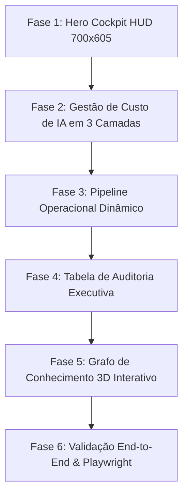

# Roadmap de Evolução e Refinamento do Showcase Executivo da AURA

Este documento consolida o planejamento de implementação técnica e visual para elevar a página de apresentação da AURA (`/showcase`), integrando os padrões corporativos modernos e componentes de referência extraídos da Harness.io (`bloco hero.txt`, `docs/bloco hero.txt` e `docs/blocos de referencia harness.txt`).

---

## 1. Princípios de Engenharia e Design

1. **Estética Anti-AI e Luxo Corporativo:**
   - Superfícies Obsidian profundas (`#07090e`, `#0b0e14`, `#0e121b`) com vidro translúcido acrílico suave.
   - Eliminação de qualquer borda neon excessiva (*edge glow*) ou efeitos artificiais.
   - Micro-bordas de precisão de 1px (`rgba(255, 255, 255, 0.08)` a `0.12`) e sombras de oclusão natural profunda.

2. **Tipografia Editorial de Alta Precisão (Padrão Harness.io):**
   - **Títulos e Headings:** `'Newsreader', 'Stkbureauserif Book', Georgia, serif` em peso *Book* (400), com 40px a 50px de tamanho, entrelinha de 1.18 a 1.20 e espaçamento negativo de -0.018em.
   - **Corpo de Texto e Descrições:** `'Geist', Verdana, sans-serif` a 16px, entrelinha de 1.6 e cor de alto contraste (`#94a3b8` / `#cbd5e1`).
   - **Métricas e Código:** `'Geist Mono', monospace` com numerais tabulares (`tabular-nums`).

3. **Linguagem Humanizada e Blindagem Intelectual:**
   - Zero travessões (`—`, `–`).
   - Zero termos técnicos internos vazados (Spacy, pgvector, bancos específicos, modelos internos).
   - Zero jargões proibidos (`fiduciário`, `alucinações`, `guardrails`, `rag`, `revoluciona`).

---

## 2. Fases de Implementação

---

### Fase 1: Hero Cockpit HUD com Proporção Executiva 700x605
*Base de referência: `bloco hero.txt` e `docs/blocos de referencia harness.txt` (L1 a L50)*

- [ ] **Container Proporcional 700x605:**
  - Adotar a estrutura `home_hero-section` e `home_hero-animation` com proporção de palco executivo 700x605 px na coluna direita do Hero.
  - Comportamento responsivo com adaptação suave em telas intermediárias e empilhamento limpo em dispositivos móveis (`max-width: 1160px`).
- [ ] **Donuts Vetoriais com Contadores Animados:**
  - Implementar os componentes `runtime-security-agent-visual_donut` com SVG `stroke-dasharray` calibrado.
  - Contador animado progressivo via JavaScript (`data-count-to="261"` para Integridade Operacional e `data-count-to="66"` para Ativos Locais Conectados).
  - Legenda alinhada com marcadores circulares coloridos e contadores numéricos tabulares.
- [ ] **Ticker de Telemetria Dinâmico:**
  - Barra de status no rodapé do HUD com pulso ativo verde esmeralda:
    `NÚCLEO AURA // PDVs Sincronizados • Fechamento Cego Ativo • 0 Divergências • Latência 38ms`

---

### Fase 2: Palco de Custo de IA em 3 Camadas Sobrepostas
*Base de referência: `docs/bloco hero.txt` (`cost-management-agent-visual_stage`)*

- [ ] **Camada 1 (Fundo): Card de Raciocínio Cognitivo:**
  - Card translúcido com cabeçalho de pensamento (*"Thought for 4s"*) e chevron de expansão.
  - Resumo de faturamento e detalhamento comparativo por canal operacional:
    - Vendas PDV (dentro do orçamento fixo local).
    - Estoque e Tanques (telemetria local sem custo de nuvem).
    - Auditoria de Caixas (conferência matemática determinística).
  - Alerta de economia: contraste entre 95% de economia com o motor local versus custos descontrolados de faturas em nuvem.
- [ ] **Camada 2 (Centro / Sobreposta): Gráfico de Barras Empilhadas:**
  - Card elevado com título *"Cost and Unit Cost Trend"*.
  - Gráfico vetorial SVG com linhas de grade de R$ 0k a R$ 20k e barras empilhadas crescentes animadas por data (`07/26` a `08/13`).
  - Segmentação visual de provedores e legenda interativa (*Nuvem Tradicional*, *Infraestrutura Local AURA*, *Economia Gerada*).
- [ ] **Camada 3 (Topo): Prompt Executivo Flutuante:**
  - Balão flutuante estilizado no topo do card com a pergunta executiva:
    *"Auditar custo unitário e desperdício de tokens na conciliação dos últimos 7 dias."*

---

### Fase 3: Pipeline Operacional Dinâmico com Varredura Conic
*Base de referência: `docs/blocos de referencia harness.txt` (L129 a L682)*

- [ ] **Coluna Esquerda: Cards de Etapas e Conectores SVG:**
  - Três etapas operacionais conectadas verticalmente:
    1. *Captura & Escudo LGPD*
    2. *Auditoria de Regras & Estoque*
    3. *Geração da Decisão Executiva*
  - Conectores verticais SVG com círculo, linha e ponta de seta direcionada.
  - Efeito de varredura perimetral luminosa com `conic-gradient` animado durante a execução ativa (`is-running`).
  - Badge de status dinâmico: spinner de carregamento durante a execução e badge verde com checkmark ao concluir (`is-success`).
- [ ] **Coluna Direita: Raciocínio Cognitivo Expansível (Sanfona):**
  - Efeito shimmer no texto enquanto a análise ocorre (*"Thinking..."*).
  - Conversão automática para botão retrátil (*"Thought for 4s"*) que o usuário pode abrir ou fechar para inspecionar os detalhes da auditoria sem poluir a tela.
  - Sincronização em tempo real com o chat emulado ao lado.

---

### Fase 4: Tabela de Auditoria Executiva com Busca
*Base de referência: `docs/blocos de referencia harness.txt` (L53 a L126)*

- [ ] **Campo de Busca Compacto:**
  - Input estilizado com ícone vetorial de lupa e visual minimalista.
- [ ] **Estrutura de Linhas e Badges Semânticos:**
  - Linhas com células limpas para *Unidade*, *Canal / PDV*, *Severidade*, *Registros Auditados* e *Status*.
  - Badges coloridos de alta autoridade:
    - Coral / Vermelho: *Crítico* (divergência ou furo detectado).
    - Âmbar: *Atenção* (tanque próximo da reserva ou pendência de nota).
    - Esmeralda: *Concluído* (100% conciliado e auditado).
- [ ] **Modo Responsivo Mobile:**
  - Overflow horizontal contido em contêiner com rolagem suave e sem quebrar o grid da página.

---

### Fase 5: Grafo de Conhecimento 3D Interativo Consolidado
*Implementado e mantido com base na referência do Point Cloud Globe*

- [ ] **Manutenção da Esfera 3D com 320 Pontos SVG:**
  - Preservar profundidade de campo, opacidades dinâmicas e transições suaves.
- [ ] **Arestas Dinâmicas Iluminadas:**
  - Realce instantâneo das conexões (`.active-edge`) e das transversais ao clicar nos nós.
- [ ] **Sincronização Tripla:**
  - Clique na lista lateral, nó do globo ou painel de raciocínio refletindo em tempo real em toda a interface.

---

### Fase 6: Validação, Qualidade e Blindagem

- [ ] **Suíte de Testes Automatizada (`scripts/test_aura_showcase.py`):**
  - Validação de rotas HTTP `/showcase` e `/apresentacao`.
  - Verificação de presença e classes de todos os novos blocos.
  - Teste de sintaxe no Node.js.
  - Teste funcional em navegador real (Microsoft Edge headless via Playwright).
  - Validação de regras de redação (0 travessões, 0 termos de infraestrutura interna vazados, 0 jargões artificiais).
- [ ] **Compatibilidade com GPU Guard & Modo Performance:**
  - Suporte a `prefers-reduced-motion` com desativação graciosa de timers e animações contínuas.
- [ ] **Sincronização de Código:**
  - Sincronização entre `scripts/build_showcase_page.py` e `web/showcase.html`.
  - Versionamento Git com commits semânticos e publicação no branch `main`.

---

## 3. Matriz de Rastreabilidade de Arquivos

| Componente | Arquivo de Origem / Referência | Arquivos Alvo no Projeto |
| :--- | :--- | :--- |
| Hero Cockpit 700x605 & Donuts | `bloco hero.txt`, `docs/blocos de referencia harness.txt` | `scripts/build_showcase_page.py`, `web/showcase.html` |
| Custo de IA em 3 Camadas | `docs/bloco hero.txt` | `scripts/build_showcase_page.py`, `web/showcase.html` |
| Pipeline Dinâmico & Sanfona | `docs/blocos de referencia harness.txt` | `scripts/build_showcase_page.py`, `web/showcase.html` |
| Tabela de Auditoria com Busca | `docs/blocos de referencia harness.txt` | `scripts/build_showcase_page.py`, `web/showcase.html` |
| Sistema Tipográfico Geist + Newsreader | Imagens DevTools Harness.io | `scripts/build_showcase_page.py`, `web/showcase.html` |
| Suíte de Validação End-to-End | Testes Playwright / Edge | `scripts/test_aura_showcase.py` |
